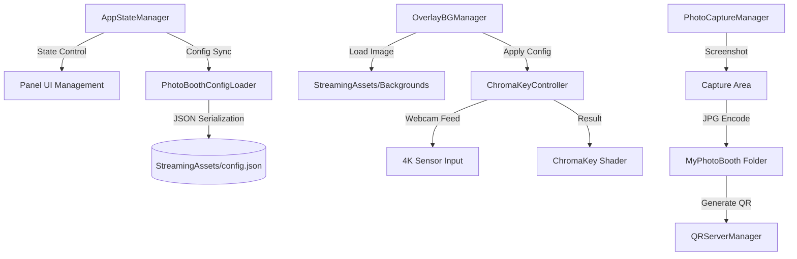

# 🌌 포천아트밸리 천문과학관 무인 포토부스 시스템
> **Art Valley Astronomical Science Museum - Data-Driven Photo Booth Solution**

포천아트밸리 천문과학관의 몰입형 전시 환경을 위해 설계된 **최첨단 무인 포토부스 시스템**입니다. 본 시스템은 단순한 사진 촬영을 넘어, 실시간 4K 크로마키 합성 기술과 유연한 데이터 기반 아키텍처를 결합하여 전시 현장의 요구사항에 즉각적으로 대응할 수 있도록 구축되었습니다.

---

## 🚀 핵심 기술 및 특장점 (Technical Highlights)

### 1. 전역/지역 크로마키 보정 엔진 (Chroma-Key Engine)
*   **Shader-Based Realtime Processing:** 고성능 GPU 셰이더를 사용하여 실시간으로 크로마키 색상을 제거하고 배경을 합성합니다.
*   **Dual-Layer Configuration:** 
    *   **Global Master:** 현장의 조명 상태에 맞춘 전역 크로마키 세팅.
    *   **Background Override:** 각 배경(우주화면, 하트 등)의 톤앤매너에 맞춘 개별 크로마키 및 컬러 그레이딩 오버라이드.
*   **Spill Removal & Edge Smoothing:** 인물 테두리의 초록빛(Color Spill)을 정교하게 제거하고 경계선을 부드럽게 처리하는 안티앨리어싱 로직이 내장되어 있습니다.

### 2. 4K Ultra HD 웹캠 제어 및 왜곡 방지
*   **Native 4K Signal:** 웹캠의 4K(3840x2160) 다이렉트 신호를 처리하여 대형 키오스크에서도 선명한 화질을 보장합니다.
*   **True-Crop Algorithm:** 센서 전체 영역에서 픽셀 단위로 크롭 영역을 계산하고, UI의 `uvRect`와 `sizeDelta`를 1:1 동기화하여 인물 이미지가 찌그러지는 현상을 원천 차단합니다.

### 3. 데이터 드리븐 아키텍처 (Data-Driven Logic)
*   **Zero-Rebuild Workflow:** `config.json` 수정만으로 배경 이미지를 추가/삭제하거나 크로마키 세팅을 변경할 수 있습니다. 
*   **StreamingAssets Integration:** 모든 영상과 이미지는 빌드 파일 외부에 위치하여, 현장에서 USB를 통해 즉각적인 리소스 교환이 가능합니다.

### 4. 지능형 관리자 시스템 (Calibration Flow)
*   **Interactive Admin Panel:** `Ctrl + Alt + S` 단축키로 진입하며, 실시간 슬라이더 조절을 통해 즉각적인 결과물을 모니터링하면서 최적의 값을 저장할 수 있습니다.
*   **Hot-Reloading:** 설정 파일 저장 시 앱 재시작 없이 즉시 엔진에 수치가 적용됩니다.

---

## 🛠 시스템 아키텍처 (Architecture)

---

## 📖 주요 컴포넌트 안내

| 컴포넌트명 | 설명 | 핵심 기능 |
| :--- | :--- | :--- |
| **AppStateManager** | 시스템의 전체적인 상태 머신(FSM) 제어 | 상태 전환, Idle 타임 리셋, 관리자 모드 브릿지 |
| **ChromaKeyController** | 실시간 영상 처리 핵심 엔진 | 4K 카메라 제어, 크로마키 셰이더 파라미터 최적화, Crop/Transform 계산 |
| **OverlayBGManager** | 배경 이미지 오케스트레이터 | StreamingAssets 내 파일 동적 로드, 배경별 설정 적용 |
| **QRServerManager** | 모바일 사진 전송 시스템 | Cloudflare Tunnel 기반 외부 접속 허용, 동적 QR 코드 생성 |
| **MasterSetupBuilder** | 에디터 자동화 툴 (Editor) | 인스펙터 일괄 연결, 비디오 도화지 생성, 시스템 헬스 체크 |

---

## ⚙️ 설정 가이드 (Setup)

### 배경 추가 방법
1.  새로운 배경 이미지(`.jpg` 권장)를 `StreamingAssets/` 폴더에 넣습니다.
2.  `config.json`의 `backgrounds` 배열에 새로운 항목을 추가하고 `bgName`을 파일명과 일치시킵니다.
3.  앱 실행 후 관리자 모드(`Ctrl+Alt+S`)에서 해당 배경의 크로마키와 줌 위치를 조절한 뒤 저장합니다.

### 관리자 단축키
*   **관리자 패널 호출/종료:** `Ctrl + Alt + S`
*   **강제 초기화(홈으로):** `Escape`
*   **설정 핫리로드:** `F5`

---

## ⚠️ 주의사항 및 보안
*   **개인정보 보호:** 촬영된 사진은 로컬 `MyPhotoBooth` 폴더에 저장되며, 보안을 위해 Git 저장소에는 업로드되지 않도록 설정되어 있습니다. (gitignore 적용)
*   **리소스 관리:** `StreamingAssets` 내의 대용량 영상 파일 로드 시 경로가 일치하는지 항상 확인하십시오.

---
**Copyright © 2024 Art Valley Astronomical Science Museum. All rights reserved.**
