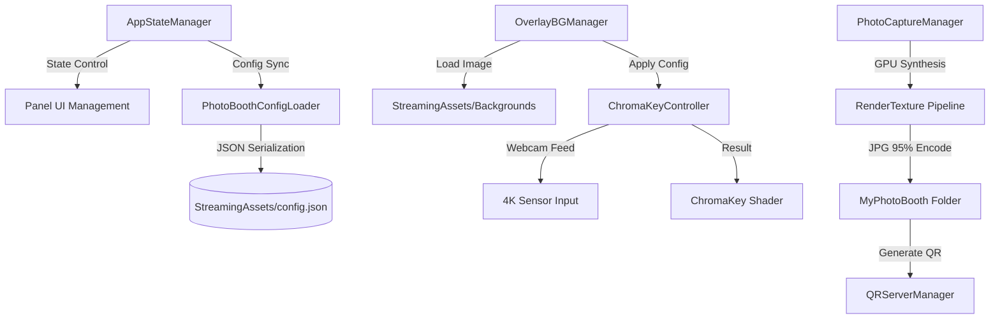

# 포천아트밸리 천문과학관 무인 포토부스 시스템

포천아트밸리 천문과학관의 몰입형 전시 환경을 위해 설계된 **최첨단 무인 포토부스 시스템**입니다. 본 시스템은 단순한 사진 촬영을 넘어, 실시간 4K 크로마키 합성 기술과 유연한 데이터 기반 아키텍처를 결합하여 전시 현장의 요구사항에 즉각적으로 대응할 수 있도록 구축되었습니다.

---

## 🚀 핵심 기술 및 특장점 (Technical Highlights)

### 1. 고정밀 GPU 크로마키 엔진 (High-Fidelity Chroma-Key)
*   **3-Pass GPU Pipeline:** 배경, 크로마키 인물, 전경 프레임을 GPU RenderTexture에서 3단계로 합성하여 화질 손실 없는 고품질 결과물을 생성합니다.
*   **고급 안티앨리어싱 (Anti-Aliasing):** 
    *   **2x SSAA:** 4K 해상도에서 렌더링 후 다운샘플링하여 경계선을 매끄럽게 처리합니다.
    *   **Alpha Multi-tap Blur:** 4:2:2 색상 압축 블록 현상을 제거하기 위해 5탭 가우시안 알파 블러(2텍셀 오프셋)를 적용합니다.
*   **Spill Removal:** 인물 테두리의 초록빛 반사광을 정교하게 제거하여 합성의 이질감을 최소화합니다.

### 2. 하드웨어 최적화 및 안정화
*   **Cloudflare Tunnel 자동 복구:** 실행 시 기존 `cloudflared.exe` 프로세스를 강제 종료 후 재시작하여 포트 충돌 및 네트워크 끊김 문제를 원천 차단합니다.
*   **드라이버 해상도 감시:** 웹캠 실행 시 실제 할당된 해상도를 로그로 기록하여 하드웨어 대역폭 문제로 인한 화질 저하를 실시간 모니터링합니다.

### 3. 데이터 드리븐 아키텍처 (Data-Driven)
*   **Zero-Rebuild:** `config.json` 수정만으로 배경 추가, 크로마키 민감도, 인물 위치(Zoom/Move/Rotation) 설정을 실시간 변경할 수 있습니다.
*   **Global/Local 설정 분리:** 전체 배경에 적용되는 마스터 설정과 특정 배경 전용 오버라이드 설정을 독립적으로 관리합니다.

---

## 🛠️ 시스템 아키텍처 (Architecture)

---

## 📅 최신 업데이트 로그 (Release Notes)

### [2026.04.25] 캡처 엔진 대규모 개편 및 화질 최적화
*   **고화질 GPU 합성 파이프라인 도입:**
    *   기존 `ReadPixels` 스크린샷 방식에서 **GPU RenderTexture 3-pass 합성** 방식으로 전환.
    *   **2x SSAA (Super Sampling):** 4K 렌더링 후 1080p 다운샘플링으로 계단현상 제거.
    *   **Alpha Multi-tap Gaussian Blur:** 2텍셀 오프셋의 5탭 샘플링으로 4:2:2 압축 깍두기 현상 해결.
*   **캡처 트랜스폼 정밀 동기화:**
    *   실시간 뷰에서 설정한 **확대(Zoom), 이동(Move), 회전(Rotation)**이 사진에도 1:1 적용되도록 UV 변환 로직 구현.
    *   **셰이더 기반 크롭(Crop) 및 페이딩:** UI 마스크 대신 셰이더 알파 마스킹을 사용하여 배경과 프레임을 보존하면서 인물만 정교하게 크롭(Softness 페이드 포함).
*   **시스템 안정성 강화:**
    *   **Cloudflare Tunnel:** 시작 시 잔존 `cloudflared.exe` 프로세스 강제 종료 로직 추가.
    *   **UI 마스크 충돌 방지:** 캡처 시 전용 머티리얼을 복제하여 `RectMask2D`에 의한 알파 파괴 현상 수정.
    *   **타이머 연장:** 촬영 카운트다운을 3초에서 **5초**로 상향 조정.
    *   **웹캠 검증:** 실제 할당 해상도 로그 확인 및 `FilterMode.Bilinear` 명시.

### [2026.04.23] UI 가독성 및 관리자 기능 강화
*   **배경 선택 UI 개선:** 하단 반투명 블랙 패널 추가 및 사이버펑크 네온(#00FFFF) 테마 적용.
*   **MasterSetupBuilder 고도화:** 모든 UI 변경사항을 원클릭으로 동기화하는 에디터 스크립트 강화.
*   **프로세스 종료 안정화:** `QRServerManager` 종료 시 백그라운드 리소스를 안전하게 해제하여 크래시 방지.

### [2024.04.18 - 04.22] UI/UX 및 하드웨어 제어 기반 구축
*   **3레이어 합성 시스템:** 배경-인물-프레임 구조 확립.
*   **조이스틱 친화적 UI:** 마우스 없이 방향키와 버튼만으로 모든 조작이 가능하도록 포커스 박스 로직 구현.
*   **실시간 캘리브레이션:** 관리자 모드(Ctrl+Alt+S)에서 7종의 파라미터(Chroma, Color Grading) 실시간 조정 기능.

---

## ⚙️ 설정 가이드 (Setup)

### 배경 추가 방법
1.  배경 이미지(`.jpg`)를 `StreamingAssets/` 폴더에 넣습니다.
2.  `config.json`의 `backgrounds` 배열에 항목을 추가하고 `bgName`을 파일명과 일치시킵니다.
3.  관리자 모드에서 크로마키 민감도와 인물 위치를 조정한 후 저장합니다.

### 관리자 단축키
*   **관리자 패널 호출/종료:** `Ctrl + Alt + S`
*   **강제 초기 화면으로:** `Escape` (0.5초 쿨다운 적용)
*   **설정 새로고침:** `F5`

---
**Copyright © 2024 Art Valley Astronomical Science Museum. All rights reserved.**
