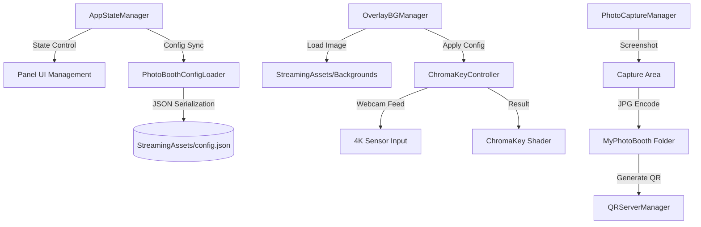

# ?뙆 ?ъ쿇?꾪듃諛몃━ 泥쒕Ц怨쇳븰愿€ 臾댁씤 ?ы넗遺€???쒖뒪??> **Art Valley Astronomical Science Museum - Data-Driven Photo Booth Solution**

?ъ쿇?꾪듃諛몃━ 泥쒕Ц怨쇳븰愿€??紐곗엯???꾩떆 ?섍꼍???꾪빐 ?ㅺ퀎??**理쒖꺼??臾댁씤 ?ы넗遺€???쒖뒪??*?낅땲?? 蹂??쒖뒪?쒖? ?⑥닚???ъ쭊 珥ъ쁺???섏뼱, ?ㅼ떆媛?4K ?щ줈留덊궎 ?⑹꽦 湲곗닠怨??좎뿰???곗씠??湲곕컲 ?꾪궎?띿쿂瑜?寃고빀?섏뿬 ?꾩떆 ?꾩옣???붽뎄?ы빆??利됯컖?곸쑝濡??€?묓븷 ???덈룄濡?援ъ텞?섏뿀?듬땲??

---

## ?? ?듭떖 湲곗닠 諛??뱀옣??(Technical Highlights)

### 1. ?꾩뿭/吏€???щ줈留덊궎 蹂댁젙 ?붿쭊 (Chroma-Key Engine)
*   **Shader-Based Realtime Processing:** 怨좎꽦??GPU ?곗씠?붾? ?ъ슜?섏뿬 ?ㅼ떆媛꾩쑝濡??щ줈留덊궎 ?됱긽???쒓굅?섍퀬 諛곌꼍???⑹꽦?⑸땲??
*   **Dual-Layer Configuration:** 
    *   **Global Master:** ?꾩옣??議곕챸 ?곹깭??留욎텣 ?꾩뿭 ?щ줈留덊궎 ?명똿.
    *   **Background Override:** 媛?諛곌꼍(?곗＜?붾㈃, ?섑듃 ?????ㅼ븻留ㅻ꼫??留욎텣 媛쒕퀎 ?щ줈留덊궎 諛?而щ윭 洹몃젅?대뵫 ?ㅻ쾭?쇱씠??
*   **Spill Removal & Edge Smoothing:** ?몃Ъ ?뚮몢由ъ쓽 珥덈줉鍮?Color Spill)???뺢탳?섍쾶 ?쒓굅?섍퀬 寃쎄퀎?좎쓣 遺€?쒕읇寃?泥섎━?섎뒗 ?덊떚?⑤━?댁떛 濡쒖쭅???댁옣?섏뼱 ?덉뒿?덈떎.

### 2. 4K Ultra HD ?뱀틺 ?쒖뼱 諛??쒓끝 諛⑹?
*   **Native 4K Signal:** ?뱀틺??4K(3840x2160) ?ㅼ씠?됲듃 ?좏샇瑜?泥섎━?섏뿬 ?€???ㅼ삤?ㅽ겕?먯꽌???좊챸???붿쭏??蹂댁옣?⑸땲??
*   **True-Crop Algorithm:** ?쇱꽌 ?꾩껜 ?곸뿭?먯꽌 ?쎌? ?⑥쐞濡??щ∼ ?곸뿭??怨꾩궛?섍퀬, UI??`uvRect`?€ `sizeDelta`瑜?1:1 ?숆린?뷀븯???몃Ъ ?대?吏€媛€ 李뚭렇?ъ????꾩긽???먯쿇 李⑤떒?⑸땲??

### 3. ?곗씠???쒕━釉??꾪궎?띿쿂 (Data-Driven Logic)
*   **Zero-Rebuild Workflow:** `config.json` ?섏젙留뚯쑝濡?諛곌꼍 ?대?吏€瑜?異붽?/??젣?섍굅???щ줈留덊궎 ?명똿??蹂€寃쏀븷 ???덉뒿?덈떎. 
*   **StreamingAssets Integration:** 紐⑤뱺 ?곸긽怨??대?吏€??鍮뚮뱶 ?뚯씪 ?몃????꾩튂?섏뿬, ?꾩옣?먯꽌 USB瑜??듯빐 利됯컖?곸씤 由ъ냼??援먰솚??媛€?ν빀?덈떎.

### 4. 吏€?ν삎 愿€由ъ옄 ?쒖뒪??(Calibration Flow)
*   **Interactive Admin Panel:** `Ctrl + Alt + S` ?⑥텞?ㅻ줈 吏꾩엯?섎ʼn, ?ㅼ떆媛??щ씪?대뜑 議곗젅???듯빐 利됯컖?곸씤 寃곌낵臾쇱쓣 紐⑤땲?곕쭅?섎㈃??理쒖쟻??媛믪쓣 ?€?ν븷 ???덉뒿?덈떎.
*   **Hot-Reloading:** ?ㅼ젙 ?뚯씪 ?€???????ъ떆???놁씠 利됱떆 ?붿쭊???섏튂媛€ ?곸슜?⑸땲??

---

## ?썱 ?쒖뒪???꾪궎?띿쿂 (Architecture)

---

## ?뱰 二쇱슂 而댄룷?뚰듃 ?덈궡

| 而댄룷?뚰듃紐?| ?ㅻ챸 | ?듭떖 湲곕뒫 |
| :--- | :--- | :--- |
| **AppStateManager** | ?쒖뒪?쒖쓽 ?꾩껜?곸씤 ?곹깭 癒몄떊(FSM) ?쒖뼱 | ?곹깭 ?꾪솚, Idle ?€??由ъ뀑, 愿€由ъ옄 紐⑤뱶 釉뚮┸吏€ |
| **ChromaKeyController** | ?ㅼ떆媛??곸긽 泥섎━ ?듭떖 ?붿쭊 | 4K 移대찓???쒖뼱, ?щ줈留덊궎 ?곗씠???뚮씪誘명꽣 理쒖쟻?? Crop/Transform 怨꾩궛 |
| **OverlayBGManager** | 諛곌꼍 ?대?吏€ ?ㅼ??ㅽ듃?덉씠??| StreamingAssets ???뚯씪 ?숈쟻 濡쒕뱶, 諛곌꼍蹂??ㅼ젙 ?곸슜 |
| **QRServerManager** | 紐⑤컮???ъ쭊 ?꾩넚 ?쒖뒪??| Cloudflare Tunnel 湲곕컲 ?몃? ?묒냽 ?덉슜, ?숈쟻 QR 肄붾뱶 ?앹꽦 |
| **MasterSetupBuilder** | ?먮뵒???먮룞????(Editor) | ?몄뒪?숉꽣 ?쇨큵 ?곌껐, 鍮꾨뵒???꾪솕吏€ ?앹꽦, ?쒖뒪???ъ뒪 泥댄겕 |

---

## ?숋툘 ?ㅼ젙 媛€?대뱶 (Setup)

### 諛곌꼍 異붽? 諛⑸쾿
1.  ?덈줈??諛곌꼍 ?대?吏€(`.jpg` 沅뚯옣)瑜?`StreamingAssets/` ?대뜑???ｌ뒿?덈떎.
2.  `config.json`??`backgrounds` 諛곗뿴???덈줈????ぉ??異붽??섍퀬 `bgName`???뚯씪紐낃낵 ?쇱튂?쒗궢?덈떎.
3.  ???ㅽ뻾 ??愿€由ъ옄 紐⑤뱶(`Ctrl+Alt+S`)?먯꽌 ?대떦 諛곌꼍???щ줈留덊궎?€ 以??꾩튂瑜?議곗젅?????€?ν빀?덈떎.

### 愿€由ъ옄 ?⑥텞??*   **愿€由ъ옄 ?⑤꼸 ?몄텧/醫낅즺:** `Ctrl + Alt + S`
*   **媛뺤젣 珥덇린???덉쑝濡?:** `Escape`
*   **?ㅼ젙 ?ル━濡쒕뱶:** `F5`

---

## ?좑툘 二쇱슂?ы빆 諛?蹂댁븞
*   **媛쒖씤?뺣낫 蹂댄샇:** 珥ъ쁺???ъ쭊?€ 濡쒖뺄 `MyPhotoBooth` ?대뜑???€?λ릺硫? 蹂댁븞???꾪됀 Git ?€?μ냼?먮뒗 ?낅줈?쒕릺吏€ ?딅룄濡??ㅼ젙?섏뼱 ?덉뒿?덈떎. (gitignore ?곸슜)
*   **由ъ냼??愿€由?** `StreamingAssets` ?댁쓽 ?€?⑸웾 ?곸긽 ?뚯씪 濡쒕뱶 ??寃쎈줈媛€ ?쇱튂?섎뗳吏€ ??긽 ?뺤씤?섏떗?쒖삤.

---

## ?뱷 理쒖떊 ?낅뜲?댄듃 濡쒓렇 (Release Notes)

### [2026.04.25] 珥ъ쁺 ?댁솕 · Cloudflare ?덉젙??· ?몃Ъ?댁꽱?떆 ?쒖젮 ?⑥튂
*   **?뱀틺??5珥??듭떖:** 珥ъ쁺 ?먰?닻땲???뚯궗???뒗 3珥?→ 5珥?濡??섎Ъ?섏뿬 ?ъ슜?먭? 利됱떆 ?쒓컙???뺣낫?덉뒿?덈떎.
*   **Cloudflare ?덉젙??媛뺥솕:** ?뚳??而댄뱶 ??? 媛덉쑝濡?`cloudflared.exe` ?꾨줈?몄뒪瑜?媛뺤쎌 醫낅즺 ??媛λ젹?섏뿬 ?뚯냽 異④뻽 諛??쓬由??꾧텞 臾몄젣瑜??닿껐?덉뒿?덈떎.
*   **怨좊뭾?댁꽱?떆(Aliasing) 媛쒖꽑:**
    *   `ReadPixels` 諛??→ **GPU RenderTexture 3-pass 而댄뵒吏??** 諛??쇰줈 珥ъ쁺 ?뚯씠?댁솕???꾨꼍 洹몃졇??由щ뙘?섏뿀?듬땲?? (諛곌꼍→?щ줈留덊궎→?꾧꼍 ?ㅼ뿬濡?GPU?먯꽌 吏곴??而댄뵒吏??)
    *   ChromaKey ?ㅽ뇨?? Pre-blur瑜?**5-tap Gaussian(?됱긽???됯뭹 而ㅼ뙆 = 1.0)**?쇰줈 洹뺣쓬?섏뿬 ?뱀틺 4:2:2 而댄룷 ?섎Ъ?쒖젮?쇰줈 ?쇱씠?? ?蹂?紐?理쒖쟻?덉뒿?덈떎.
    *   ???μ텇 ?먁솕 JPG 90% → **JPG 95%** 濡??쇻???됱젙?덉뒿?덈떎.
*   **?щ∼ 異④뻽 遺쎈?媛쒖꽑:** `localScale` 異④뻽 ??? `RectMask2D.padding`???ㅽ겙?? ?щ줈?섎맒???딁???諛곌꼍媛 ?ㅻ늿 ?됲긽?섎뒗 臾몄젣瑜?`cropScale = 1/zoom` 蹂?二꾩궛 濡쒖쭅???닿껐?덉뒿?덈떎.
*   **愿由ъ옄 誰쒕줈蹂?踰꾪듉 ?덉젙??** 湲곌낵?꾩뿬 ?щ줈留덊궎 議곗젅 ??? `dummyBg` 湲고븯媛?(`Zoom=0`, `Contrast=0`)濡??뱀틺媛 ?됲뻽?덉뗗 臾몄젣瑜??됵Ж??湲고븯媛?紐⑤뱶 紐낅젰??異붿쟻?쇰줈 ?닿껐?덉뒿?덈떎.
*   **?湲??붾㈃ ?뚮삚?섏젆 諛⑸쾿:** ESC ?덁?? 愿由ъ옄 紐⑤뱶 ?쒒맦 ??媛뺤쎌 ?ф젰?섏젆???ъ뜑濡?以??붾㈃?쇰줈 ?섏씠뒗 踰꾪듉瑜?0.5珥??쐞???ωぉ濡?李④??뒿?덈떎.
*   **?щ줈留덊궎 ?ㅼ젙 ?꾩떆???:** ?щ줈留덊궎/?щ∼???꾩껜 怨쇱젙 ?ㅼ젙(`GlobalChromaConfig`)?쇰줈 怨좎젙?섍퀬, 諛곌꼍蹂?媛쒕퀎 ?ㅼ젙???됱긽 蹂댁씙·蹂?二꾩쇰줈 議곕???섏뿬 `Local Override` 媛뺤씠?????꾨꼍 ?앹쉶?몄뒿?덈떎.

### [2026.04.23] UI 媛?낆꽦 諛??쒖뒪???덉젙??媛뺥솕 ?⑥튂
*   **諛곌꼍 ?좏깮 UI ?쒖씤??媛쒖꽑:** 
*   **?먮뵒???먮룞??MasterSetupBuilder) 怨좊룄??** ?덈∼寃?異붽???諛섑닾紐??⑤꼸 ?앹꽦 諛??띿뒪???됱긽 ?숆린??濡쒖쭅???먮룞 ?명똿 ?댁뿉 ?듯빀?섏뿬, ?대┃ ??踰덉쑝濡?紐⑤뱺 UI 蹂€寃??ы빆??利됱떆 ?곸슜?섎룄濡??낅뜲?댄듃?덉뒿?덈떎.

### [2024.04.22] UI/UX ?뺣? 怨좊룄??諛??덉젙???⑥튂
*   **寃곌낵 ?붾㈃(Result) ?덉씠?꾩썐 理쒖쟻??** 
    *   ?ㅼ떆李띻린/泥섏쓬?쇰줈 踰꾪듉???믪씠瑜?100px濡?怨좎젙?섍퀬 ?몃줈濡??뺣젹?섏뿬, QR 肄붾뱶瑜?媛€由щ뜕 ?덉씠?꾩썐 媛꾩꽠 臾몄젣瑜??닿껐?덉뒿?덈떎.
    *   踰꾪듉 ?띿뒪???ш린 ?뺣? 諛?蹂쇰뱶 泥섎━瑜??듯빐 吏곴??곸씤 議곗옉??媛€?ν븯?꾨줉 媛쒖꽑?덉뒿?덈떎.
*   **議곗씠?ㅽ떛 而ㅼ꽌 ?뺣???媛쒖꽑:** 踰꾪듉???쇰쿁 ?꾩튂???곴??놁씠 ?ㅼ젣 踰꾪듉??湲고븯?숈쟻 以묒븰???뺥솗??異붿쟻?섎룄濡?怨꾩궛 濡쒖쭅??蹂€寃쏀븯??而ㅼ꽌 ?닿툔???꾩긽???닿껐?덉뒿?덈떎.
*   **?ㅼ옉??諛⑹? ?쒕젅??** 諛곌꼍 ?좏깮 利됱떆 珥ъ쁺?쇰줈 ?섏뼱媛€吏€ ?딅룄濡?0.8珥덉쓽 ?€湲??쒓컙??異붽??섏뿬, ?ъ슜?먭? ?좏깮??諛곌꼍???몄??????덈뒗 ?좎삁 ?쒓컙???뺣낫?덉뒿?덈떎.

### [2024.04.18] ?곗씠??留덉뒪??諛??대?吏€ ?덉씠?대쭅 怨좊룄??*   **?곗씠??留덉뒪??RectMask2D) 吏€??** `ChromaKey.shader`媛€ ?좊땲??UI??`RectMask2D` 而댄룷?뚰듃瑜??꾨꼍??吏€?먰븯?꾨줉 ?곗씠??濡쒖쭅???섏젙?섏뿬, ?뱀틺 ?붾㈃???뺢탳???щ∼(Clipping)??媛€?ν빐議뚯뒿?덈떎.
*   **3?덉씠??而댄룷吏€???쒖뒪???꾩꽦:** 諛곌꼍(Background), ?뱀틺(Webcam), ?꾧꼍(Foreground Frame)??3?④퀎 ?덉씠??援ъ“瑜??뺣┰?섍퀬, `_front.png` ?뚯씪???듯븳 ?꾧꼍 ?꾨젅???먮룞 濡쒕뱶 湲곕뒫??援ы쁽?덉뒿?덈떎.

### [2024.04.17] 愿€由ъ옄 ?몃옖?ㅽ뤌 ?쒖뼱 諛?議곗씠?ㅽ떛 UI ?꾩엯
*   **?뱀틺 Transform 蹂듭썝:** 愿€由ъ옄 紐⑤뱶(2?④퀎)?먯꽌 ?몃Ъ???ш린(Zoom), X/Y ?꾩튂 ?대룞, ?뚯쟾(Rotation)??媛쒕퀎 諛곌꼍蹂꾨줈 ?몃??섍쾶 議곗젅?섍퀬 ?€?ν븷 ???덈뒗 湲곕뒫??蹂듦뎄/異붽??섏뿀?듬땲??
*   **議곗씠?ㅽ떛 移쒗솕??UI 援ъ꽦:** 留덉슦???놁씠???꾩??대뱶 議곗씠?ㅽ떛(諛⑺뼢??怨?臾쇰━ 踰꾪듉留뚯쑝濡?6媛쒖쓽 諛곌꼍???좏깮?????덈룄濡? 遺€?쒕읇寃??대룞?섎뒗 '?ъ빱???€?됲듃 諛뺤뒪' UI?€ ?ㅻ퉬寃뚯씠??濡쒖쭅???곸슜?섏뿀?듬땲??
*   **?먮뵒???먮룞??怨좊룄??** ???뗭뾽 ?ㅽ겕由쏀듃(`MasterSetupBuilder`)媛€ ?낅뜲?댄듃?섏뼱, ????踰덉쓽 ?대┃留뚯쑝濡??좉퇋 ?щ씪?대뜑 4醫낃낵 議곗씠?ㅽ떛 而ㅼ꽌瑜??ъ뿉 ?먮룞 ?앹꽦 諛??ㅽ겕由쏀듃 ?곌껐???섑뻾?⑸땲?? 
    

    
?먯꽭???덈궡 諛??뗭뾽 媛€?대뱶 蹂닿린

    
    1. ?좊땲??李??곷떒 硫붾돱 `PhotoBooth > ?몣 ?ъ씤?? ?꾩껜 ?쒖뒪???먮룞 ?명똿` ?대┃
    2. 議곗씠?ㅽ떛(諛⑺뼢?? ???대룞, `Enter` ?뱀? `Space` 濡?諛곌꼍 ?좏깮 媛€??    3. 愿€由ъ옄 李?Ctrl+Alt+S) 2?④퀎 ?곗륫 蹂€???щ씪?대뜑 議곗옉
    
    

### [2024.04.16] 愿€由ъ옄 ?쒖뒪??諛??붿쭊 怨좊룄???⑥튂
*   **愿€由ъ옄 UI ?꾨㈃ ?ш뎄異?** 湲곗〈??遺덉븞?뺥븳 ?덉씠?꾩썐 ?쒖뒪?쒖쓣 ?먭린?섍퀬, ?덈? 醫뚰몴 湲곕컲??吏곴??곸씤 愿€由ъ옄 ?⑤꼸濡??덈∼寃?由щ퉴?⑸릺?덉뒿?덈떎. (?쒓? ?고듃 `NotoSansKR` ?꾨꼍 吏€??
*   **7???뺣? 蹂댁젙 ?щ씪?대뜑 ?꾩엯:** 
    *   **Chroma:** 媛먮룄, 遺€?쒕윭?€, ?ㅽ븘 ?쒓굅
    *   **Color:** 諛앷린, ?€鍮? 梨꾨룄, ?됱“ (諛곌꼍蹂?媛쒕퀎 ?ㅼ젙 媛€??
*   **?됱긽 異붿텧 ?뚭퀬由ъ쬁 ?곸떊:** Canvas Scaler???댁긽??媛꾩꽠??臾댁떆?섍퀬 ?ㅼ젣 ?붾㈃ ?쎌???1:1濡?留ㅼ묶?섎뒗 Screen-Space 醫뚰몴 蹂€??濡쒖쭅???꾩엯?섏뿬 ?됱긽 異붿텧???뺥솗?꾨? 洹밸??뷀뻽?듬땲??
*   **?쒖뒪???먮룞??蹂닿컯:** `MasterSetupBuilder`媛€ ????以묐났 而댄룷?뚰듃瑜?媛먯? 諛??뺣━?섎ʼn, 理쒖쟻??UI 諛곗튂(醫뚯긽???щ갚 ?뺣낫)瑜??먮룞?쇰줈 ?섑뻾?섎룄濡??낅뜲?댄듃?섏뿀?듬땲??
*   **?덉젙???μ긽:** 愿€由ъ옄 紐⑤뱶 吏꾩엯 ??諛곌꼍 ?대┃ 愿€??諛??낅젰 媛꾩꽠 臾몄젣瑜??닿껐?섏뿬 罹섎━釉뚮젅?댁뀡 ?묒뾽???몄쓽?깆쓣 ?믪??듬땲??

---
**Copyright 짤 2024 Art Valley Astronomical Science Museum. All rights reserved.**

