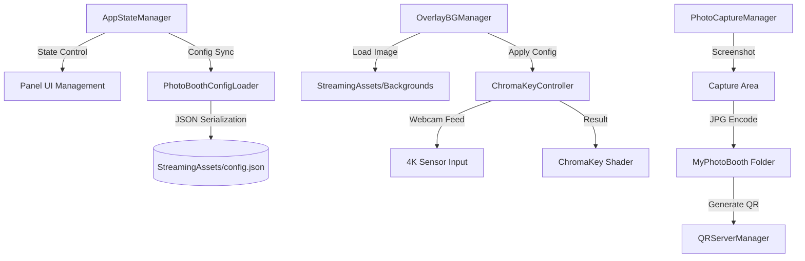

# 🌌 포천아트밸리 천문과학관 무인 포토부스 시스템
> **Art Valley Astronomical Science Museum - Data-Driven Photo Booth Solution**

포천아트밸리 천문과학관의 몰입형 전시 환경을 위해 설계된 **최첨단 무인 포토부스 시스템**입니다. 본 시스템은 단순한 사진 촬영을 넘어, 실시간 4K 크로마키 합성 기술과 유연한 데이터 기반 아키텍처를 결합하여 전시 현장의 요구사항에 즉각적으로 대응할 수 있도록 구축되었습니다.

---

## 🚀 핵심 기술 및 특장점 (Technical Highlights)

### 1. 전역/지역 크로마키 보정 엔진 (Chroma-Key Engine)
*   **Shader-Based Realtime Processing:** 고성능 GPU 셰이더를 사용하여 실시간으로 크로마키 색상을 제거하고 배경을 합성합니다.
*   **Dual-Layer Configuration:** 
    *   **Global Master:** 현장의 조명 상태에 맞춘 전역 크로마키 세팅.
    *   **Background Override:** 각 배경(우주화면, 하트 등)의 톤앤매너에 맞춘 개별 크로마키 및 컬러 그레이딩 오버라이드.
*   **Spill Removal & Edge Smoothing:** 인물 테두리의 초록빛(Color Spill)을 정교하게 제거하고 경계선을 부드럽게 처리하는 안티앨리어싱 로직이 내장되어 있습니다.

### 2. 4K Ultra HD 웹캠 제어 및 왜곡 방지
*   **Native 4K Signal:** 웹캠의 4K(3840x2160) 다이렉트 신호를 처리하여 대형 키오스크에서도 선명한 화질을 보장합니다.
*   **True-Crop Algorithm:** 센서 전체 영역에서 픽셀 단위로 크롭 영역을 계산하고, UI의 `uvRect`와 `sizeDelta`를 1:1 동기화하여 인물 이미지가 찌그러지는 현상을 원천 차단합니다.

### 3. 데이터 드리븐 아키텍처 (Data-Driven Logic)
*   **Zero-Rebuild Workflow:** `config.json` 수정만으로 배경 이미지를 추가/삭제하거나 크로마키 세팅을 변경할 수 있습니다. 
*   **StreamingAssets Integration:** 모든 영상과 이미지는 빌드 파일 외부에 위치하여, 현장에서 USB를 통해 즉각적인 리소스 교환이 가능합니다.

### 4. 지능형 관리자 시스템 (Calibration Flow)
*   **Interactive Admin Panel:** `Ctrl + Alt + S` 단축키로 진입하며, 실시간 슬라이더 조절을 통해 즉각적인 결과물을 모니터링하면서 최적의 값을 저장할 수 있습니다.
*   **Hot-Reloading:** 설정 파일 저장 시 앱 재시작 없이 즉시 엔진에 수치가 적용됩니다.

---

## 🛠 시스템 아키텍처 (Architecture)

---

## 📖 주요 컴포넌트 안내

| 컴포넌트명 | 설명 | 핵심 기능 |
| :--- | :--- | :--- |
| **AppStateManager** | 시스템의 전체적인 상태 머신(FSM) 제어 | 상태 전환, Idle 타임 리셋, 관리자 모드 브릿지 |
| **ChromaKeyController** | 실시간 영상 처리 핵심 엔진 | 4K 카메라 제어, 크로마키 셰이더 파라미터 최적화, Crop/Transform 계산 |
| **OverlayBGManager** | 배경 이미지 오케스트레이터 | StreamingAssets 내 파일 동적 로드, 배경별 설정 적용 |
| **QRServerManager** | 모바일 사진 전송 시스템 | Cloudflare Tunnel 기반 외부 접속 허용, 동적 QR 코드 생성 |
| **MasterSetupBuilder** | 에디터 자동화 툴 (Editor) | 인스펙터 일괄 연결, 비디오 도화지 생성, 시스템 헬스 체크 |

---

## ⚙️ 설정 가이드 (Setup)

### 배경 추가 방법
1.  새로운 배경 이미지(`.jpg` 권장)를 `StreamingAssets/` 폴더에 넣습니다.
2.  `config.json`의 `backgrounds` 배열에 새로운 항목을 추가하고 `bgName`을 파일명과 일치시킵니다.
3.  앱 실행 후 관리자 모드(`Ctrl+Alt+S`)에서 해당 배경의 크로마키와 줌 위치를 조절한 뒤 저장합니다.

### 관리자 단축키
*   **관리자 패널 호출/종료:** `Ctrl + Alt + S`
*   **강제 초기화(홈으로):** `Escape`
*   **설정 핫리로드:** `F5`

---

## ⚠️ 주의사항 및 보안
*   **개인정보 보호:** 촬영된 사진은 로컬 `MyPhotoBooth` 폴더에 저장되며, 보안을 위해 Git 저장소에는 업로드되지 않도록 설정되어 있습니다. (gitignore 적용)
*   **리소스 관리:** `StreamingAssets` 내의 대용량 영상 파일 로드 시 경로가 일치하는지 항상 확인하십시오.

---

## 📝 최신 업데이트 로그 (Release Notes)

### [2026.04.23] UI 가독성 및 시스템 안정성 강화 패치
*   **배경 선택 UI 시인성 개선:** 
    *   배경 선택 화면 하단에 **반투명 검은색 띠 패널**을 추가하여 화려한 배경 위에서도 자막이 선명하게 보이도록 개선했습니다.
    *   안내 자막을 **사이버펑크 네온 청록색(#00FFFF)** 테마로 변경하고 폰트 크기를 확대(90)하여 시각적 직관성을 높였습니다.
*   **UI 테마 통합:** 대기 화면(Standby)의 깜빡이는 안내 문구 색상을 배경 선택 UI와 동일한 네온 청록색으로 동기화하여 시스템 전체의 톤앤매너를 일치시켰습니다.
*   **시스템 종료 로직 안정화:** `QRServerManager` 종료 시 백그라운드 프로세스(Cloudflare Tunnel 등)를 정리하는 과정에서 발생하던 `InvalidOperationException` 오류를 해결하여 앱 종료 안정성을 확보했습니다.
*   **에디터 자동화(MasterSetupBuilder) 고도화:** 새롭게 추가된 반투명 패널 생성 및 텍스트 색상 동기화 로직을 자동 세팅 툴에 통합하여, 클릭 한 번으로 모든 UI 변경 사항이 즉시 적용되도록 업데이트했습니다.

### [2024.04.22] UI/UX 정밀 고도화 및 안정성 패치
*   **결과 화면(Result) 레이아웃 최적화:** 
    *   다시찍기/처음으로 버튼의 높이를 100px로 고정하고 세로로 정렬하여, QR 코드를 가리던 레이아웃 간섭 문제를 해결했습니다.
    *   버튼 텍스트 크기 확대 및 볼드 처리를 통해 직관적인 조작이 가능하도록 개선했습니다.
*   **조이스틱 커서 정밀도 개선:** 버튼의 피벗 위치에 상관없이 실제 버튼의 기하학적 중앙을 정확히 추적하도록 계산 로직을 변경하여 커서 어긋남 현상을 해결했습니다.
*   **오작동 방지 딜레이:** 배경 선택 즉시 촬영으로 넘어가지 않도록 0.8초의 대기 시간을 추가하여, 사용자가 선택한 배경을 인지할 수 있는 유예 시간을 확보했습니다.

### [2024.04.18] 셰이더 마스킹 및 이미지 레이어링 고도화
*   **셰이더 마스킹(RectMask2D) 지원:** `ChromaKey.shader`가 유니티 UI의 `RectMask2D` 컴포넌트를 완벽히 지원하도록 셰이더 로직을 수정하여, 웹캠 화면의 정교한 크롭(Clipping)이 가능해졌습니다.
*   **3레이어 컴포지팅 시스템 완성:** 배경(Background), 웹캠(Webcam), 전경(Foreground Frame)의 3단계 레이어 구조를 확립하고, `_front.png` 파일을 통한 전경 프레임 자동 로드 기능을 구현했습니다.

### [2024.04.17] 관리자 트랜스폼 제어 및 조이스틱 UI 도입
*   **웹캠 Transform 복원:** 관리자 모드(2단계)에서 인물의 크기(Zoom), X/Y 위치 이동, 회전(Rotation)을 개별 배경별로 세밀하게 조절하고 저장할 수 있는 기능이 복구/추가되었습니다.
*   **조이스틱 친화적 UI 구성:** 마우스 없이도 아케이드 조이스틱(방향키)과 물리 버튼만으로 6개의 배경을 선택할 수 있도록, 부드럽게 이동하는 '포커스 셀렉트 박스' UI와 네비게이션 로직이 적용되었습니다.
*   **에디터 자동화 고도화:** 씬 셋업 스크립트(`MasterSetupBuilder`)가 업데이트되어, 단 한 번의 클릭만으로 신규 슬라이더 4종과 조이스틱 커서를 씬에 자동 생성 및 스크립트 연결을 수행합니다. 
    

    
자세한 안내 및 셋업 가이드 보기

    
    1. 유니티 창 상단 메뉴 `PhotoBooth > 👑 올인원: 전체 시스템 자동 세팅` 클릭
    2. 조이스틱(방향키) ↔ 이동, `Enter` 혹은 `Space` 로 배경 선택 가능
    3. 관리자 창(Ctrl+Alt+S) 2단계 우측 변환 슬라이더 조작
    
    

### [2024.04.16] 관리자 시스템 및 엔진 고도화 패치
*   **관리자 UI 전면 재구축:** 기존의 불안정한 레이아웃 시스템을 폐기하고, 절대 좌표 기반의 직관적인 관리자 패널로 새롭게 리빌딩되었습니다. (한글 폰트 `NotoSansKR` 완벽 지원)
*   **7단 정밀 보정 슬라이더 도입:** 
    *   **Chroma:** 감도, 부드러움, 스필 제거
    *   **Color:** 밝기, 대비, 채도, 색조 (배경별 개별 설정 가능)
*   **색상 추출 알고리즘 혁신:** Canvas Scaler의 해상도 간섭을 무시하고 실제 화면 픽셀을 1:1로 매칭하는 Screen-Space 좌표 변환 로직을 도입하여 색상 추출의 정확도를 극대화했습니다.
*   **시스템 자동화 보강:** `MasterSetupBuilder`가 씬 내 중복 컴포넌트를 감지 및 정리하며, 최적의 UI 배치(좌상단 여백 확보)를 자동으로 수행하도록 업데이트되었습니다.
*   **안정성 향상:** 관리자 모드 진입 시 배경 클릭 관통 및 입력 간섭 문제를 해결하여 캘리브레이션 작업의 편의성을 높였습니다.

---
**Copyright © 2024 Art Valley Astronomical Science Museum. All rights reserved.**
