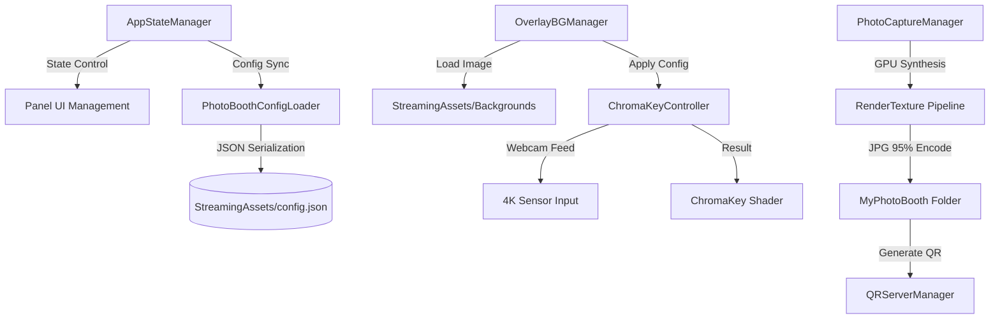

# 포천아트밸리 천문과학관 무인 포토부스 시스템

포천아트밸리 천문과학관의 몰입형 전시 환경을 위해 설계된 **최첨단 무인 포토부스 시스템**입니다. 본 시스템은 단순한 사진 촬영을 넘어, 실시간 4K 크로마키 합성 기술과 유연한 데이터 기반 아키텍처를 결합하여 전시 현장의 요구사항에 즉각적으로 대응할 수 있도록 구축되었습니다.

---

## 🚀 핵심 기술 및 특장점 (Technical Highlights)

### 1. 고정밀 GPU 크로마키 엔진 (High-Fidelity Chroma-Key)
*   **Shader-Based Realtime Processing:** 고성능 GPU 셰이더를 사용하여 실시간으로 크로마키 색상을 제거하고 배경을 합성합니다.
*   **3-Pass GPU Pipeline:** 배경, 크로마키 인물, 전경 프레임을 GPU RenderTexture에서 3단계로 합성하여 화질 손실 없는 고품질 결과물을 생성합니다.
*   **고급 안티앨리어싱 (Anti-Aliasing):** 
    *   **2x SSAA:** 4K 해상도에서 렌더링 후 다운샘플링하여 경계선을 매끄럽게 처리합니다.
    *   **Alpha Multi-tap Blur:** 4:2:2 색상 압축 블록 현상을 제거하기 위해 5탭 가우시안 알파 블러(2텍셀 오프셋)를 적용합니다.
*   **Spill Removal & Edge Smoothing:** 인물 테두리의 초록빛 반사광(Color Spill)을 정교하게 제거하고 경계면을 부드럽게 처리하는 로직이 내장되어 있습니다.

### 2. 4K Ultra HD 및 트루 크롭 (True-Crop)
*   **Native 4K Signal:** 웹캠의 4K(3840x2160) 다이렉트 신호를 처리하여 대형 키오스크에서도 선명한 화질을 보장합니다.
*   **True-Crop Algorithm:** 센서 전체 영역에서 픽셀 단위로 크롭 영역을 계산하고, UI의 `uvRect`와 `sizeDelta`를 1:1 동기화하여 인물 이미지가 찌그러지는 현상을 원천 차단합니다.

### 3. 데이터 드리븐 아키텍처 (Data-Driven Logic)
*   **Zero-Rebuild Workflow:** `config.json` 수정만으로 배경 이미지 추가/삭제 및 크로마키 민감도 설정을 실시간 변경할 수 있습니다. 
*   **StreamingAssets Integration:** 모든 영상과 이미지는 빌드 파일 외부에 위치하여, 현장에서 USB를 통해 즉각적인 리소스 교체가 가능합니다.

### 4. 지능형 관리자 시스템 (Calibration Flow)
*   **Interactive Admin Panel:** `Ctrl + Alt + S` 단축키로 진입하며, 실시간 슬라이더 조절을 통해 즉각적인 결과물을 모니터링하며 최적의 값을 저장할 수 있습니다.
*   **Hot-Reloading:** 설정 파일 저장 시 재시작 없이 즉시 엔진에 수치가 적용됩니다.

---

## 🛠️ 시스템 아키텍처 (Architecture)

---

## 📅 업데이트 로그 (Release Notes)

### [2026.04.25] 캡처 엔진 대규모 개편 및 화질 최적화
*   **고화질 GPU 합성 파이프라인 도입:**
    *   기존 `ReadPixels` 스크린샷 방식에서 **GPU RenderTexture 3-pass 합성** 방식으로 전환. (배경→크로마키→전경 레이어 GPU 직접 합성)
    *   **2x SSAA (Super Sampling):** 4K 렌더링 후 1080p 다운샘플링으로 계단현상 제거.
    *   **Alpha Multi-tap Gaussian Blur:** 2텍셀 오프셋의 5탭 샘플링으로 4:2:2 압축 깍두기 현상 해결.
*   **캡처 트랜스폼 및 크롭 완벽 동기화:**
    *   **Shader-based Transform:** UI에서 설정한 확대(Zoom), 이동(Move), 회전(Rotation) 값을 셰이더 UV 변환 로직으로 인코딩하여 사진에도 1:1 반영.
    *   **셰이더 기반 크롭(Crop) 및 페이딩:** UI 마스크 대신 셰이더 알파 마스킹을 사용하여 배경/프레임을 보존하면서 인물만 정교하게 크롭(Softness 페이드 포함).
*   **시스템 안정성 강화:**
    *   **Cloudflare Tunnel:** 시작 시 잔존 `cloudflared.exe` 프로세스 강제 종료 로직 추가로 네트워크 충돌 방지.
    *   **UI 마스크 충돌 방지:** 캡처 시 전용 머티리얼을 복제하여 `RectMask2D`에 의한 알파 파괴 현상 수정.
    *   **타이머 연장:** 촬영 카운트다운을 3초에서 **5초**로 상향 조정.
    *   **웹캠 검증:** 실제 할당 해상도 로그 확인 및 `FilterMode.Bilinear` 명시.
*   **기타 개선:** JPG 저장 품질을 90%에서 **95%**로 상향.

### [2026.04.23] UI 가독성 및 관리자 기능 강화
*   **배경 선택 UI 시인성 개선:** 하단 반투명 블랙 패널 추가 및 사이버펑크 네온 테마 적용.
*   **MasterSetupBuilder 고도화:** 새로 추가된 반투명 패널 생성 및 텍스트 색상 동기화 로직을 자동 세팅 기능에 통합.
*   **프로세스 종료 안정화:** `QRServerManager` 종료 시 리소스 해제 로직 강화.

### [2024.04.22] UI/UX 정밀 고도화 및 안정화 패치
*   **결과 화면(Result) 레이아웃 최적화:** 
    *   '다시찍기/처음으로' 버튼 높이 고정 및 세로 정렬로 QR 코드 간섭 문제 해결.
    *   버튼 텍스트 크기 확대 및 볼드 처리로 직관성 개선.
*   **조이스틱 커서 정확도 개선:** 버튼의 실제 기하학적 중앙을 추적하도록 계산 로직 변경.
*   **오작동 방지 딜레이:** 배경 선택 즉시 촬영으로 넘어가지 않도록 0.8초의 대기 시간 추가.

### [2024.04.18] 데이터 마스킹 및 이미지 레이어링 고도화
*   **UI 마스킹(RectMask2D) 지원:** `ChromaKey.shader`가 유니티 UI의 `RectMask2D`를 완벽 지원하도록 수정하여 정교한 클리핑 가능.
*   **3레이어 컴포지트 시스템 완성:** 배경(Background), 인물(Webcam), 전경(Foreground Frame)의 3단계 레이어 구조 확립 및 자동 로드 기능 구현.

### [2024.04.17] 관리자 트랜스폼 제어 및 조이스틱 UI 도입
*   **인물 Transform 복원:** 관리자 모드에서 인물의 크기(Zoom), X/Y 위치, 회전(Rotation)을 배경별로 개별 조절하고 저장하는 기능 구현.
*   **조이스틱 친화적 UI 구성:** 마우스 없이 조이스틱과 버튼만으로 6개의 배경을 선택할 수 있는 '포커스 이펙트 박스' 적용.
*   **MasterSetupBuilder 고도화:** 원클릭으로 신규 슬라이더와 조이스틱 커서 세팅을 자동 수행하는 에디터 스크립트 업데이트.

### [2024.04.16] 관리자 시스템 및 엔진 고도화 패치
*   **관리자 UI 전면 재설계:** 노토산스(NotoSansKR) 폰트 적용 및 좌표 기반 직관적 패널 리뉴얼.
*   **7종의 정밀 보정 슬라이더:** Chroma(감도, 부드러움, 스필 제거), Color(밝기, 대비, 채도, 색조) 설정 지원.
*   **색상 추출 알고리즘 혁신:** Screen-Space 좌표 변환 로직 도입으로 색상 추출 정확도 극대화.

---

## ⚙️ 설정 가이드 (Setup)

### 배경 추가 방법
1.  새로운 배경 이미지(`.jpg` 권장)를 `StreamingAssets/` 폴더에 넣습니다.
2.  `config.json`의 `backgrounds` 배열에 항목을 추가하고 `bgName`을 파일명과 일치시킵니다.
3.  앱 실행 후 관리자 모드(`Ctrl+Alt+S`)에서 크로마키와 인물 위치를 조절한 후 저장합니다.

### 관리자 단축키
*   **관리자 패널 호출/종료:** `Ctrl + Alt + S`
*   **강제 초기화(홈으로):** `Escape`
*   **설정 새로고침:** `F5`

---
**Copyright © 2024 Art Valley Astronomical Science Museum. All rights reserved.**
