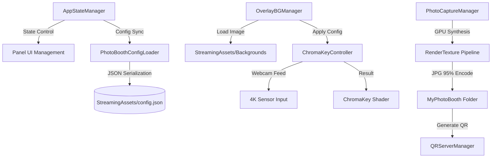

# 포천아트밸리 천문과학관 무인 포토부스 시스템

포천아트밸리 천문과학관의 몰입형 전시 환경을 위해 설계된 **최첨단 무인 포토부스 시스템**입니다. 본 시스템은 단순한 사진 촬영을 넘어, 실시간 4K 크로마키 합성 기술과 유연한 데이터 기반 아키텍처를 결합하여 전시 현장의 요구사항에 즉각적으로 대응할 수 있도록 구축되었습니다.

---

## 🚀 핵심 기술 및 특장점 (Technical Highlights)

### 1. 고정밀 GPU 크로마키 엔진 (High-Fidelity Chroma-Key)
*   **Shader-Based Realtime Processing:** 고성능 GPU 셰이더를 사용하여 실시간으로 크로마키 색상을 제거하고 배경을 합성합니다.
*   **3-Pass GPU Pipeline:** 배경, 크로마키 인물, 전경 프레임을 GPU RenderTexture에서 3단계로 합성하여 화질 손실 없는 고품질 결과물을 생성합니다.
*   **고급 안티앨리어싱 (Anti-Aliasing):** 
    *   **2x SSAA:** 4K 해상도에서 렌더링 후 다운샘플링하여 경계선을 매끄럽게 처리합니다.
    *   **Alpha Multi-tap Blur:** 4:2:2 색상 압축 블록 현상을 제거하기 위해 5탭 가우시안 알파 블러(2텍셀 오프셋)를 적용합니다.
*   **Spill Removal & Edge Smoothing:** 인물 테두리의 초록빛 반사광(Color Spill)을 정교하게 제거하고 경계면을 부드럽게 처리하는 로직이 내장되어 있습니다.

### 2. 4K Ultra HD 및 트루 크롭 (True-Crop)
*   **Native 4K Signal:** 웹캠의 4K(3840x2160) 다이렉트 신호를 처리하여 대형 키오스크에서도 선명한 화질을 보장합니다.
*   **True-Crop Algorithm:** 센서 전체 영역에서 픽셀 단위로 크롭 영역을 계산하고, UI의 `uvRect`와 `sizeDelta`를 1:1 동기화하여 인물 이미지가 찌그러지는 현상을 원천 차단합니다.

### 3. 데이터 드리븐 아키텍처 (Data-Driven Logic)
*   **Zero-Rebuild Workflow:** `config.json` 수정만으로 배경 이미지 추가/삭제 및 크로마키 민감도 설정을 실시간 변경할 수 있습니다. 
*   **StreamingAssets Integration:** 모든 영상과 이미지는 빌드 파일 외부에 위치하여, 현장에서 USB를 통해 즉각적인 리소스 교체가 가능합니다.

---

## 🛠️ 시스템 아키텍처 (Architecture)

---

## 🧩 주요 컴포넌트 및 상세 기능 (Components & Functions)

| 컴포넌트명 | 설명 | 핵심 기능 및 주요 함수 |
| :--- | :--- | :--- |
| **AppStateManager** | 시스템의 전체적인 상태 머신(FSM) 및 흐름 제어 | - `SwitchState()`: 대기, 촬영, 결과 화면 간 상태 전환 - `ResetToIdle()`: 일정 시간 미사용 시 초기 화면 복귀 로직 - 관리자 모드(Ctrl+Alt+S) 진입 및 UI 토글 관리 |
| **ChromaKeyController** | 실시간 영상 처리 및 크로마키 제어 핵심 엔진 | - `ApplyTrueCrop()`: 픽셀 기반 정밀 크롭 및 UI 동기화 - `ApplyTransform()`: 실시간 확대(Zoom), 이동, 회전 반영 - `PickColor()`: 화면 클릭 시 해당 좌표의 색상을 크로마키 타겟으로 추출 |
| **PhotoCaptureManager** | 고품질 사진 생성 및 저장 프로세스 담당 | - `HighQualityCapture()`: 3-pass GPU 합성을 통한 4K 기반 촬영 - `CaptureMat` 복제: UI 마스크 간섭 제거를 위한 동적 머티리얼 생성 - `ReadPixels`: 최종 합성 결과물을 JPG 95% 품질로 인코딩 및 저장 |
| **OverlayBGManager** | 배경/프레임 리소스 관리 및 설정 동기화 | - `LoadBackgrounds()`: StreamingAssets 내 이미지를 런타임에 동적으로 로드 - `GetConfigForBackground()`: 현재 배경에 맞는 개별 크로마키/트랜스폼 값 매칭 |
| **QRServerManager** | 촬영된 사진의 모바일 전송을 위한 서버 시스템 | - `StartCloudflareTunnel()`: 외부 접속을 위한 터널링 자동 시작 - `KillExistingProcess()`: 중복 실행된 터널링 프로세스 강제 종료로 포트 충돌 방지 - QR 코드 동적 생성 및 웹 페이지 서빙 |
| **MasterSetupBuilder** | 에디터 자동화 및 시스템 일괄 구성 도구 (Editor) | - `BuildAll()`: 신규 UI 요소 생성, 스크립트 연결, 슬라이더 세팅 자동화 - 인스펙터 일괄 연결 및 시스템 무결성 체크 |

---

## 📅 업데이트 로그 (Release Notes)

### [2026.04.25] 캡처 엔진 대규모 개편 및 화질 최적화
*   **고화질 GPU 합성 파이프라인 도입:**
    *   기존 `ReadPixels` 스크린샷 방식에서 **GPU RenderTexture 3-pass 합성** 방식으로 전환. (배경→크로마키→전경 레이어 GPU 직접 합성)
    *   **2x SSAA (Super Sampling):** 4K 렌더링 후 1080p 다운샘플링으로 계단현상 제거.
    *   **Alpha Multi-tap Gaussian Blur:** 2텍셀 오프셋의 5탭 샘플링으로 4:2:2 압축 깍두기 현상 해결.
*   **캡처 트랜스폼 및 크롭 완벽 동기화:**
    *   **Shader-based Transform:** UI에서 설정한 확대(Zoom), 이동(Move), 회전(Rotation) 값을 셰이더 UV 변환 로직으로 인코딩하여 사진에도 1:1 반영.
    *   **셰이더 기반 크롭(Crop) 및 페이딩:** UI 마스크 대신 셰이더 알파 마스킹을 사용하여 배경/프레임을 보존하면서 인물만 정교하게 크롭(Softness 페이드 포함).
*   **시스템 안정성 강화:**
    *   **Cloudflare Tunnel:** 시작 시 잔존 `cloudflared.exe` 프로세스 강제 종료 로직 추가로 네트워크 충돌 방지.
    *   **UI 마스크 충돌 방지:** 캡처 시 전용 머티리얼을 복제하여 `RectMask2D`에 의한 알파 파괴 현상 수정.
    *   **타이머 연장:** 촬영 카운트다운을 3초에서 **5초**로 상향 조정.
    *   **웹캠 검증:** 실제 할당 해상도 로그 확인 및 `FilterMode.Bilinear` 명시.
    *   **무인 키오스크 안정화 (Stabilization):**
        *   **메모리 누수 차단:** 사진 캡처 시 기존 미리보기 텍스처를 `Destroy()`로 명시적 해제하여 OOM 방지.
        *   **리소스 점유 해제:** 앱 종료 시 `WebCamTexture`를 `Destroy()`하여 하드웨어 점유 잠김 현상 해결.
        *   **수치 정규화:** UI 크롭 값을 셰이더용 UV(0~1) 좌표로 정밀 변환하여 전달.
*   **기타 개선:** JPG 저장 품질을 90%에서 **95%**로 상향.

### [2026.04.23] UI 가독성 및 관리자 기능 강화
*   **배경 선택 UI 시인성 개선:** 하단 반투명 블랙 패널 추가 및 사이버펑크 네온 테마 적용.
*   **MasterSetupBuilder 고도화:** 신규 UI 요소 자동 생성 로직 강화.

### [2024.04.16 - 04.22] UI/UX 및 하드웨어 제어 기반 구축
*   **3레이어 합성 시스템:** 배경-인물-프레임 구조 확립.
*   **조이스틱 친화적 UI:** 마우스 없이 방향키와 버튼만으로 모든 조작이 가능하도록 포커스 박스 로직 구현.
*   **실시간 캘리브레이션:** 관리자 모드(Ctrl+Alt+S)에서 7종의 파라미터(Chroma, Color Grading) 실시간 조정 기능.

---

## ⚙️ 상세 설정 및 운영 가이드 (Setup & Operation)

### 1. 신규 배경 리소스 추가 프로세스
1.  **이미지 준비:** 배경 이미지(`.jpg`)와 필요 시 전경 프레임(`.png`, 투명 포함)을 준비합니다.
2.  **파일 배치:** `Assets/StreamingAssets/` 폴더 내에 이미지 파일을 복사합니다.
3.  **Config 등록:** `config.json`의 `backgrounds` 배열에 새 오브젝트를 추가합니다.
    *   `bgName`: 확장자를 제외한 파일명
    *   `hasLocalChroma`: 개별 크로마키 값을 사용할지 여부
4.  **캘리브레이션:** 앱 실행 후 해당 배경을 선택하고 관리자 모드(`Ctrl+Alt+S`)에서 인물 위치와 크로마키 값을 세밀하게 조정한 후 `Save` 버튼을 누릅니다.

### 2. 관리자 단축키 및 특수 기능
*   **관리자 패널 호출/종료:** `Ctrl + Alt + S`
*   **강제 초기화(홈으로):** `Escape` (0.5초 쿨다운 적용으로 오작동 방지)
*   **설정 새로고침:** `F5` (수정된 `config.json`을 즉시 다시 읽어옴)
*   **색상 직접 추출:** 관리자 모드에서 실시간 화면의 배경 영역을 마우스로 클릭하면 자동으로 타겟 색상이 추출됩니다.

### 3. 하드웨어 및 네트워크 문제 해결
*   **웹캠 화질 저하 시:** 유니티 콘솔에서 `[ChromaKey] Actual Resolution` 로그를 확인하여 웹캠이 4K로 정상 인식되었는지 체크합니다. (USB 3.0 포트 사용 권장)
*   **QR 코드 미생성 시:** 터미널에서 `cloudflared` 프로세스가 정상 작동 중인지 확인합니다. 시스템 시작 시 자동으로 기존 프로세스를 클린업하도록 설계되어 있습니다.

---
**Copyright © 2024 Art Valley Astronomical Science Museum. All rights reserved.**
