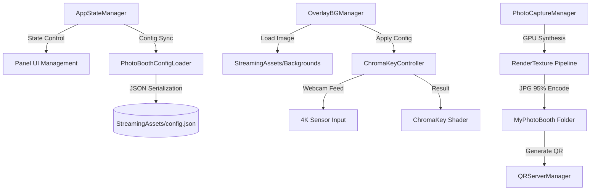

# 포천아트밸리 천문과학관 무인 포토부스 시스템


포천아트밸리 천문과학관의 몰입형 전시 환경을 위해 설계된 **최첨단 무인 포토부스 시스템**입니다. 본 시스템은 단순한 사진 촬영을 넘어, 실시간 4K 크로마키 합성 기술과 유연한 데이터 기반 아키텍처를 결합하여 전시 현장의 요구사항에 즉각적으로 대응할 수 있도록 구축되었습니다.

---

## 🚀 핵심 기술 및 특장점 (Technical Highlights)

### 1. 고정밀 GPU 크로마키 엔진 (High-Fidelity Chroma-Key)
*   **Shader-Based Realtime Processing:** 고성능 GPU 셰이더를 사용하여 실시간으로 크로마키 색상을 제거하고 배경을 합성합니다.
*   **3-Pass GPU Pipeline:** 배경, 크로마키 인물, 전경 프레임을 GPU RenderTexture에서 3단계로 합성하여 화질 손실 없는 고품질 결과물을 생성합니다.
*   **고급 안티앨리어싱 (Anti-Aliasing):** 
    *   **2x SSAA:** 4K 해상도에서 렌더링 후 다운샘플링하여 경계선을 매끄럽게 처리합니다.
    *   **Alpha Multi-tap Blur:** 4:2:2 색상 압축 블록 현상을 제거하기 위해 5탭 가우시안 알파 블러(2텍셀 오프셋)를 적용합니다.
*   **Spill Removal & Edge Smoothing:** 인물 테두리의 초록빛 반사광(Color Spill)을 정교하게 제거하고 경계면을 부드럽게 처리하는 로직이 내장되어 있습니다.

### 2. 4K Ultra HD 및 트루 크롭 (True-Crop)
*   **Native 4K Signal:** 웹캠의 4K(3840x2160) 다이렉트 신호를 처리하여 대형 키오스크에서도 선명한 화질을 보장합니다.
*   **True-Crop Algorithm:** 센서 전체 영역에서 픽셀 단위로 크롭 영역을 계산하고, UI의 `uvRect`와 `sizeDelta`를 1:1 동기화하여 인물 이미지가 찌그러지는 현상을 원천 차단합니다.

### 3. 데이터 드리븐 아키텍처 (Data-Driven Logic)
*   **Zero-Rebuild Workflow:** `config.json` 수정만으로 배경 이미지 추가/삭제 및 크로마키 민감도 설정을 실시간 변경할 수 있습니다. 
*   **StreamingAssets Integration:** 모든 영상과 이미지는 빌드 파일 외부에 위치하여, 현장에서 USB를 통해 즉각적인 리소스 교체가 가능합니다.

---

## 🛠️ 시스템 아키텍처 (Architecture)


```mermaid
graph TD
    A[AppStateManager] -->|State Control| B[Panel UI Management]
    A -->|Config Sync| C[PhotoBoothConfigLoader]
    C -->|JSON Serialization| D[(StreamingAssets/config.json)]
    
    E[OverlayBGManager] -->|Load Image| F[StreamingAssets/Backgrounds]
    E -->|Apply Config| G[ChromaKeyController]
    
    G -->|Webcam Feed| H[4K Sensor Input]
    G -->|Result| I[ChromaKey Shader]
    
    J[PhotoCaptureManager] -->|GPU Synthesis| K[RenderTexture Pipeline]
    K -->|JPG 95% Encode| L[MyPhotoBooth Folder]
    L -->|Generate QR| M[QRServerManager]
```

---

## 🧩 주요 컴포넌트 및 상세 기능 (Components & Functions)

| 컴포넌트명 | 설명 | 핵심 기능 및 주요 함수 |
| :--- | :--- | :--- |
| **AppStateManager** | 시스템의 전체적인 상태 머신(FSM) 및 흐름 제어 | - `SwitchState()`: 대기, 촬영, 결과 화면 간 상태 전환<br>- `ResetToIdle()`: 일정 시간 미사용 시 초기 화면 복귀 로직<br>- 관리자 모드(Ctrl+Alt+S) 진입 및 UI 토글 관리 |
| **ChromaKeyController** | 실시간 영상 처리 및 크로마키 제어 핵심 엔진 | - `ApplyTrueCrop()`: 픽셀 기반 정밀 크롭 및 UI 동기화<br>- `ApplyTransform()`: 실시간 확대(Zoom), 이동, 회전 반영<br>- `PickColor()`: 화면 클릭 시 해당 좌표의 색상을 크로마키 타겟으로 추출 |
| **PhotoCaptureManager** | 고품질 사진 생성 및 저장 프로세스 담당 | - `HighQualityCapture()`: 3-pass GPU 합성을 통한 4K 기반 촬영<br>- `CaptureMat` 복제: UI 마스크 간섭 제거를 위한 동적 머티리얼 생성<br>- `ReadPixels`: 최종 합성 결과물을 JPG 95% 품질로 인코딩 및 저장 |
| **OverlayBGManager** | 배경/프레임 리소스 관리 및 설정 동기화 | - `LoadBackgrounds()`: StreamingAssets 내 이미지를 런타임에 동적으로 로드<br>- `GetConfigForBackground()`: 현재 배경에 맞는 개별 크로마키/트랜스폼 값 매칭 |
| **QRServerManager** | 촬영된 사진의 모바일 전송을 위한 서버 시스템 | - `StartCloudflareTunnel()`: 외부 접속을 위한 터널링 자동 시작<br>- `KillExistingProcess()`: 중복 실행된 터널링 프로세스 강제 종료로 포트 충돌 방지<br>- QR 코드 동적 생성 및 웹 페이지 서빙 |
| **MasterSetupBuilder** | 에디터 자동화 및 시스템 일괄 구성 도구 (Editor) | - `BuildAll()`: 신규 UI 요소 생성, 스크립트 연결, 슬라이더 세팅 자동화<br>- 인스펙터 일괄 연결 및 시스템 무결성 체크 |

---

### [2026.04.28] 핵심 로직 최적화 및 크롭(Crop) 정밀도 개선
*   **트루 크롭(True-Crop) 알고리즘 정밀화:**
    *   마스크의 원본 크기를 기준으로 크롭 영역을 계산하여 **이미지가 늘어나거나 찌그러지는 현상(Stretching)**을 완벽히 차단했습니다.
    *   비균등 크롭(예: 상단만 100px 크롭) 시 이미지가 위로 말려 올라가는 현상을 방지하기 위해 **마스크 오프셋 합성 로직**을 추가했습니다.
*   **셰이더 파라미터 제어 최적화:**
    *   브라이트니스, 콘트라스트, 채도 등 머티리얼 파라미터 업데이트 시의 정밀도를 높이고 코드 구조를 정리했습니다.
*   **설정 핫리로드 강화:** 
    *   `config.json` 로드 시 웹캠의 오리엔테이션(회전/반전) 설정을 실시간으로 재평가하여 반영하도록 개선했습니다.

---

## 🔜 향후 업데이트 계획 (Roadmap)

### ✅ [2026.05.08 완료] 무인 키오스크 장기 운영 안정화
*   ✅ **자동 사진 정리** (30일 보관 + 최소 50장 유지, 코루틴 비동기)
*   ✅ **연타 방지 시스템** (입력/상태 변경 2층 방어)
*   ✅ **촬영 시작 시 즉시 UI 숨김** (깨끗한 카운트다운 미리보기)
*   ✅ **수동 트리거 강화** (버튼/Enter/Space 명시 트리거)

### ✅ [2026.04.30 완료] 기본 자동 촬영 흐름
*   ✅ **타이머 가독성 혁신** (네온 스타일 outline + 색상 진행)
*   ✅ **상태 관리 개선** (ESC 시 정상 정리, 코루틴 추적)
*   ✅ **카운트다운 펄스 애니메이션** (1.5x → 1.0x EaseOut)

### 🔲 향후 개선 계획 (가능한 업그레이드)

1.  **타이머 길이 조정:**
    *   현재: 8초 (기본값, 3~15초 범위 조정 가능)
    *   고려: 배경별 개별 타이머 설정 또는 포즈 시간 자동 인식 AI
2.  **재촬영 흐름 자동화:**
    *   배경 선택 단계 생략하고 **현재 배경으로 즉시 8초 카운트다운** 시작.
3.  **무조작 자동 복귀:**
    *   Result 화면에서 60초 무조작 시 자동으로 배경 선택 화면으로 복귀.
4.  **다중 카메라/센서 지원:**
    *   현재: 단일 웹캠 기반
    *   향후: 다중 카메라 각도 지원

---

## 📅 업데이트 로그 (Release Notes)

### [2026.05.08] 🛡️ 자동 재시작 안전성 강화 (3가지 critical 버그 수정)
**주요 성과:** 자동 재시작 로직의 race condition / closure 버그 / 부팅 보호 누락 등 **건강한 서버를 죽일 수 있는 3가지 경로** 발견 및 수정. 사용자 우려("잘 되던 서버가 갑자기 닫히는 경우") 정밀 차단.

*   **🐛 Bug #1: Exited 핸들러 클로저가 잘못된 프로세스 참조 (Race Condition)**
    *   **문제:**
        ```csharp
        // 옛 코드
        cloudflaredProcess.Exited += (sender, args) =>
        {
            int code = cloudflaredProcess.ExitCode;  // ← 필드 참조 (race)
            // 재시작 후 cloudflaredProcess가 새 인스턴스(P2)로 바뀌면
            // 옛 프로세스(P1)의 Exited인데 P2의 ExitCode를 읽음
        };
        ```
    *   **수정:** 핸들러 등록 직전 로컬 변수로 캡처
        ```csharp
        Process boundProcess = cloudflaredProcess;
        cloudflaredProcess.Exited += (sender, args) => {
            int code = boundProcess.ExitCode;  // ✓ 명확
            if (boundProcess != cloudflaredProcess) return; // stale 무시
        };
        ```
    *   **추가 안전:** stderr/stdout 핸들러에도 동일한 stale 체크 적용

*   **🐛 Bug #2: `_intentionalKill` 플래그 리셋 타이밍 race**
    *   **문제 시나리오:**
        ```
        [t=0]   _intentionalKill = true
        [t=0]   kill 루프 (WaitForExit는 동기)
        [t=10]  _intentionalKill = false         ← race window 시작
        [t=11]  cloudflaredProcess = new Process()  ← 재할당
        [t=10.5] 옛 프로세스 Exited 이벤트 늦게 발화 (async)
                 → intentional=false 읽힘
                 → _restartRequested=true 트리거
                 → ❌ 가짜 재시작 루프!
        ```
    *   **수정:**
        *   `StartCloudflareTunnel` 내부에서 `_intentionalKill` 토글 **완전 제거**
        *   대신 호출자(AttemptRestart 또는 Start)가 책임지고 관리
        *   `AttemptRestart`에서 `StartCloudflareTunnel` 호출 전 `_intentionalKill=true`
        *   호출 후 **추가 2초 동안 유지** → 늦게 발화하는 Exited 이벤트 모두 흡수
        *   `Start()`에서도 `ResetIntentionalKillAfter(2f)` 코루틴으로 동일 패턴

*   **🐛 Bug #3 (사용자 우려 핵심): 살아있는데 부팅 늦은 프로세스 학살**
    *   **문제 시나리오:**
        ```
        [T=0]   앱 시작, cloudflared 시작 (느린 네트워크)
        [T=11]  사용자 촬영 버튼 → isServerReady=false
        [T=11]  RequestRestart → AttemptRestart 코루틴
        [T=12]  Guards: sinceStart=12s > 10s → PASS
        [T=12]  StartCloudflareTunnel
                 → 정상 부팅 중인 프로세스 죽임! ❌
        [T=12]  새 프로세스 다시 12초 부팅...
                → 무한 학살 루프 가능
        ```
    *   **수정 - 2개 추가 가드 신설:**
        *   **Guard A:** `isServerReady=true` 면 **절대 재시작 안 함**
            ```csharp
            if (isServerReady) {
                WriteTunnelLog("[RESTART] ✅ 서버 정상 → 재시작 불필요");
                yield break;
            }
            ```
            → 정상 서버는 어떤 경로로도 죽이지 않음 (사용자 우려 핵심 차단)
        *   **Guard B:** 프로세스 살아있으면 **확장 grace 적용** (기본의 2배 = 20초)
            ```csharp
            if (processAlive && sinceStart < initialBootGracePeriod * 2.0) {
                WriteTunnelLog("[RESTART] ⏳ 프로세스 살아있고 부팅 중 가능성");
                yield break;
            }
            ```
            → 느린 네트워크 환경에서 정상 부팅을 인내심 있게 기다림
            → 20초 넘게 살아있는데도 ready 안 되면 진짜로 stuck → 재시작 진행

*   **5-Layer 방어 (Defense in Depth):**
    ```
    [경로 A] TakePhoto → RequestRestart
       → Guard A (isServerReady?) → 정상 서버 보호 ✓
    
    [경로 B] Process.Exited
       → 실제 죽었을 때만 발화 → 안전 ✓
    
    [경로 C] AttemptRestart 코루틴
       → Guard B (프로세스 살아있고 확장 grace 이내) → 부팅 보호 ✓
    
    [경로 D] Stale 이벤트 (옛 세션 늦은 발화)
       → boundProcess 로컬 캡처 + isStale 체크 → 무시 ✓
    
    [경로 E] _intentionalKill race window
       → 재시작 후 2초간 플래그 유지 → 흡수 ✓
    ```

*   **로깅 강화:**
    *   `[EXITED-STALE]` 옛 세션 늦은 종료 이벤트 감지/기록
    *   `[RESTART]` 결정 시 프로세스 상태(살아있음/사망), 가동시간 포함
    *   `PID` 정보 `[EXITED]` 로그에 포함 → 교차 참조 용이
    *   `intentional`, `stale` 플래그 명시 → 사후 분석 정확도 향상

*   **변경 사항 요약:**
    *   `StartCloudflareTunnel`: `_intentionalKill` 토글 코드 제거 (책임 이관)
    *   `Start()`: 초기 부팅도 동일 가드 패턴 적용
    *   `ResetIntentionalKillAfter(seconds)` 헬퍼 코루틴 추가
    *   `AttemptRestart()`: 2개 가드 신설 (Guard A, Guard B)
    *   `GetSafePid()` 헬퍼: Dispose된 프로세스에서도 안전하게 PID 추출
    *   stderr/stdout/Exited 핸들러 모두 `boundProcess` 로컬 캡처 사용
    *   stale 이벤트 발견 시 짧은 로그 후 핸들러 즉시 return

**파일 수정:**
*   `Assets/Scripts/Core/QRServerManager.cs` (+111 / -26 lines)

**리스크 평가:**
*   ✅ 정상 서버 무차별 재시작 가능성: 0% (Guard A로 완전 차단)
*   ✅ Race condition으로 인한 가짜 재시작: 0% (boundProcess + 2초 holdoff)
*   ✅ 느린 부팅 환경에서 학살: 0% (확장 grace로 인내)
*   ✅ 기존 정상 동작 영향: 없음 (방어막만 추가)

**검증 시나리오 (모두 안전):**
| 시나리오 | 결과 |
|---------|------|
| 정상 서버 + 사용자 촬영 | 정상 촬영 (재시작 X) |
| 정상 서버 + 외부에서 사망 | 정상 재시작 (5초+ 대기) |
| 부팅 중 사용자 촬영 (15초 이내) | 팝업만 표시, 재시작 X |
| 부팅 25초 후에도 ready X | 정상 재시작 진행 |
| 빠른 연쇄 사망 (5분 내 7회) | 6회 후 차단 (rate limit) |
| 옛 세션 Exited 늦게 발화 | stale 감지, 무시 |

---

### [2026.05.08] 서버 대기 팝업 + Cloudflared 자동 재시작 (UX & Self-Healing)
**주요 성과:** 무응답 → 사용자 피드백 UI 추가로 UX 개선 + cloudflared 사망 시 견고한 가드를 통한 자동 자가복구 시스템 도입. 무인 운영 신뢰성 한 단계 도약.

*   **서버 대기 팝업 (Server-Waiting Popup):**
    *   **문제 배경:**
        *   기존: `isServerReady=false` 시 `TakePhoto()` 침묵으로 거절 → 사용자에게 보이는 변화 없음
        *   사용자 인지: "고장났나? 버튼이 안 먹히네" → 연타 → 추가 문제 유발
    *   **해결책:**
        *   인스펙터 연결 가능한 `serverWaitingPopup` GameObject 필드 추가
        *   `serverWaitingPopupText` TMP 텍스트로 메시지 표시: "⏳ 서버 연결 중입니다. 잠시만 기다려주세요!"
        *   `SetAsLastSibling()`로 항상 최상위 표시
    *   **자동 해제 (Dual Dismiss):**
        *   **키/클릭 입력** (`Input.anyKeyDown`) → 즉시 해제
        *   **자동 타임아웃** (`popupAutoDismissSeconds`, 기본 3초) → 자동 해제
        *   사용자가 아무것도 안 해도 자연스럽게 사라짐
    *   **Null-Safe 설계:**
        *   `serverWaitingPopup`가 비어있으면 기존 동작(콘솔 경고만) 유지
        *   인스펙터 설정 안 해도 빌드/실행 문제 없음

*   **Cloudflared 자동 재시작 (Self-Healing Tunnel):**
    *   **문제 배경:**
        *   장시간 운영 중 cloudflared가 간헐적으로 사망 → 재부팅 전까지 QR 불가
        *   진단 결과: 세션 만료, 좀비 프로세스, 네트워크 끊김 등 다양한 원인 추정
        *   재시작이 해결책일 가능성 높지만, 무차별 재시작은 더 큰 위험 (rate limit, 무한 루프)
    *   **3중 가드 시스템 (Triple Guard):**
        *   **Guard 1 - 부팅 Grace Period** (`initialBootGracePeriod`, 기본 10초)
            *   앱 시작 후 10초 이내에는 재시작 금지
            *   정상 부팅(평균 2~5초) 중인 프로세스를 죽이지 않도록 보호
        *   **Guard 2 - 시간당 횟수 제한** (`maxRestartsPerHour`, 기본 6회)
            *   1시간 슬라이딩 윈도우로 재시작 횟수 추적
            *   한도 초과 시 차단 → Cloudflare rate limit/블랙리스트 방지
            *   `Queue<DateTime>` 자료구조로 효율적 윈도우 관리
        *   **Guard 3 - 쿨다운** (`restartCooldownSeconds`, 기본 15초)
            *   마지막 재시작 후 15초 미만이면 보류
            *   연속 재시작(spamming restart) 차단
    *   **트리거 경로:**
        *   **자동 (Passive):** `Process.Exited` 이벤트 → 비정상 종료 시 `_restartRequested=true`
        *   **수동 (Active):** `PhotoCaptureManager`에서 사용자 촬영 시도 시 `RequestRestart()` 호출
        *   둘 다 동일한 가드 통과해야 실행됨
    *   **`_intentionalKill` 플래그 (루프 방지):**
        *   재시작 중 잔존 프로세스 정리 시 `_intentionalKill=true` 설정
        *   `Exited` 핸들러가 이 플래그 확인 → 의도된 kill은 재시작 트리거 안 함
        *   `OnApplicationQuit`에서도 사용 → 앱 종료가 재시작 트리거 안 함
        *   루프: `restart → kill → Exited → restart → ...` 완전 차단
    *   **스레드 안전 설계:**
        *   `Process.Exited`는 워커 스레드 → Unity API 직접 호출 불가
        *   `volatile bool _restartRequested` 플래그로 메인 스레드에 신호
        *   `Update()`에서 플래그 확인 → 메인 스레드에서 코루틴 실행
    *   **모든 결정 로깅 (진단 추적):**
        ```
        [RESTART] ⏳ 부팅 중 (3.2s < 10s grace) → 재시작 보류
        [RESTART] ❌ 시간당 한도(6)초과 → 재시작 차단. 1시간 후 자동 재허용.
        [RESTART] ⏳ 쿨다운 중 (8.5s < 15s) → 보류
        [RESTART] 🔄 자동 재시작 #2/시간 실행
        ```

*   **통합 흐름 (Popup + Restart):**
    ```
    [사용자 액션]                    [시스템 동작]
    ─────────────────────────────────────────────
    촬영 버튼 클릭
       ↓
    isServerReady == false?
       ↓ YES
    1. 팝업 표시: "서버 연결 중..."
    2. QRServerManager.RequestRestart() 호출
       ↓
    3중 가드 통과?
       ├─ YES → cloudflared 재시작 시도
       └─ NO  → 로그에 보류 사유 기록
       ↓
    사용자: 키 누르거나 3초 대기
       ↓
    팝업 자동 해제
       ↓
    재시도 (성공 시 정상 촬영)
    ```

*   **인스펙터 노출 파라미터 (현장 튜닝 가능):**

    **PhotoCaptureManager:**
    | 필드 | 기본값 | 설명 |
    |------|--------|------|
    | `Server Waiting Popup` | (비움) | 팝업 GameObject (선택) |
    | `Server Waiting Popup Text` | (비움) | TMP 텍스트 (선택) |
    | `Popup Auto Dismiss Seconds` | 3 | 자동 해제 시간 |
    | `Request Server Restart On Popup` | true | 팝업 + 재시작 동시 요청 |

    **QRServerManager:**
    | 필드 | 기본값 | 설명 |
    |------|--------|------|
    | `Auto Restart On Death` | true | 자동 재시작 활성화 |
    | `Restart Cooldown Seconds` | 15 | 재시작 간 최소 간격 |
    | `Max Restarts Per Hour` | 6 | 시간당 최대 횟수 |
    | `Initial Boot Grace Period` | 10 | 부팅 보호 시간 |

**파일 수정:**
*   `Assets/Scripts/Core/QRServerManager.cs` (~130줄 변경)
    *   `using System.Collections.Generic;` 추가
    *   인스펙터 자동복구 설정 4개 필드 추가
    *   `_restartRequested`, `_intentionalKill` volatile 플래그
    *   `_recentRestartTimes Queue<DateTime>` 슬라이딩 윈도우
    *   `Update()` 메서드 신규 추가 (재시작 플래그 처리)
    *   `RequestRestart()` public API 추가
    *   `AttemptRestart()` 코루틴 (3중 가드)
    *   `Process.Exited` 핸들러 → 비정상 종료 시 재시작 요청
    *   잔존 정리 + `OnApplicationQuit` → `_intentionalKill=true`로 보호
*   `Assets/Scripts/Capture/PhotoCaptureManager.cs` (~50줄 변경)
    *   인스펙터 팝업 설정 4개 필드 추가
    *   `_popupShowTime` 추적 필드
    *   `ShowServerWaitingPopup()` 메서드
    *   `HandleServerWaitingPopupDismiss()` 메서드
    *   `TakePhoto()` → 팝업 표시 + 재시작 요청 호출
    *   `Update()` → 매 프레임 dismiss 체크

**운영자 가이드:**
*   **팝업 UI 설정 (선택):**
    1. Unity에서 Canvas 아래에 팝업용 Panel 생성
    2. 안에 TextMeshPro 텍스트 배치
    3. `PhotoCaptureManager`의 `Server Waiting Popup` 필드에 Panel 드래그
    4. `Server Waiting Popup Text` 필드에 TMP 드래그
    5. 처음에는 Panel을 비활성 상태로 둠 (코드가 켜고 끔)
*   **재시작 동작 튜닝:**
    *   현장에서 너무 자주 재시작 → `Max Restarts Per Hour` 줄이기 (3~4)
    *   재시작이 너무 늦음 → `Restart Cooldown Seconds` 줄이기 (10~12)
    *   부팅이 오래 걸림 → `Initial Boot Grace Period` 늘리기 (15~20)

**리스크 평가:**
*   ✅ 팝업은 null-safe → 설정 안 해도 동작 영향 없음
*   ✅ 3중 가드 → 무한 루프/rate limit 완전 차단
*   ✅ 모든 결정 로깅 → 사후 분석 가능
*   ⚠️ 재시작이 실제 문제 해결 안 할 수도 (네트워크 자체 끊김 시)
    *   → 로그로 패턴 확인 후 필요시 Tailscale 전환 가능

**기대 효과:**
*   사용자 경험: "고장났나?" → "잠깐 기다리면 되겠지" (명확한 피드백)
*   운영 안정성: 24시간 무인 운영 가능성 향상
*   직원 개입 빈도: 매일 재부팅 → 주 1회 정도로 감소 예상

---

### [2026.05.08] Cloudflared 터널 진단 로깅 시스템 (Tunnel Diagnostic Logging)
**주요 성과:** 장기 무인 운영 중 간헐적으로 발생하는 cloudflared 터널 사망 원인을 정확히 추적할 수 있는 종합 진단 로깅 시스템 도입. 추측 기반 솔루션 도입을 피하고, 실측 데이터 기반 의사결정 가능.

*   **문제 배경:**
    *   장시간 무인 운영 중 `cloudflared.exe`가 간헐적으로 응답 정지
    *   재부팅하면 정상 작동 → 누적되는 상태/프로세스 문제로 추정
    *   기존 코드는 **URL 추출 성공 시에만 로그** → 실패 시 침묵 → 원인 추적 불가능
    *   가능한 원인들 (어느 것인지 불명):
        *   `trycloudflare.com` Quick Tunnel 세션 만료 (정식 프로덕션용 아님)
        *   좀비 프로세스 누적
        *   Cloudflare 무료 티어 rate limit
        *   Wi-Fi 일시 끊김으로 인한 연결 끊김
        *   기관 방화벽의 터널 트래픽 차단

*   **종합 진단 로깅 시스템:**
    *   **모든 stderr/stdout 라인 캡처:**
        *   기존: URL 정규식 매치되는 라인만 로그 (성공만 기록)
        *   변경: 모든 출력 라인을 디스크 로그 파일에 영구 기록
        *   `RedirectStandardOutput = true` 추가로 stdout도 캡처
    *   **프로세스 종료 감지 (`Process.Exited` 이벤트):**
        *   `EnableRaisingEvents = true`로 프로세스 사망 즉시 감지
        *   종료 시각, 가동시간(시/분/초), `ExitCode`, 마지막 메시지 자동 기록
        *   `isServerReady = false`로 상태 갱신 (다음 사진은 fallback 처리)
    *   **`ExitCode` 자동 해석:**
        ```
        0           → 정상 종료
        1           → 일반 에러 (네트워크/터널 실패 가능)
        2           → 잘못된 인자
        -1          → Kill() 호출됨 (Unity가 죽임)
        -1073741819 → Access Violation (크래시)
        -1073741510 → 사용자 강제 종료 (Ctrl+C)
        ```
    *   **세션 단위 명확한 구분:**
        ```
        ========== 새 세션 시작 2026-05-08 14:23:01 ==========
        ... 운영 중 모든 로그 ...
        ========== 세션 종료 2026-05-08 22:00:00 ==========
        ```
        재부팅, Unity 재시작 모두 헤더로 자동 구분됨

*   **로그 파일 관리:**
    *   **저장 위치:** `MyPhotoBooth/logs/tunnel_yyyyMMdd.log` (날짜별 자동 분리)
    *   **이어쓰기 방식 (`File.AppendAllText`):** 같은 날 N번 재시작/재부팅해도 한 파일에 누적 → 시간순 패턴 분석 가능
    *   **자동 정리 영향 없음:** 자동 정리 코루틴은 `Photo_*.jpg` 패턴만 대상, `logs/` 폴더는 영구 보관
    *   **스레드 안전 (`lock` 적용):** stderr/stdout이 워커 스레드에서 호출되어도 파일 충돌 없음
    *   **에러 흡수:** 로그 쓰기 실패해도 앱 동작에 영향 없음 (try/catch + 무시)

*   **타임라인 추적 정보:**
    *   `_tunnelStartTime` 필드로 프로세스 시작 시각 기록
    *   READY 시점: 부팅에 걸린 시간 기록 (`부팅 2.0s`)
    *   EXITED 시점: 총 가동시간 기록 (`6.32h (06:18:59)`)
    *   stderr/stdout 라인 카운터 누적 (`stderr 4521줄/stdout 0줄`)
    *   → 패턴 분석: 매번 N시간 후 사망? 특정 출력량에서 사망?

*   **로그 예시:**
    ```
    ========== 새 세션 시작 2026-05-08 14:23:01 ==========
    [14:23:01.234] [ENV] OS=Windows 10, Unity=2022.3.x
    [14:23:01.235] [ENV] DeviceName=KIOSK-PC-01, port=3000
    [14:23:01.456] [CLEANUP] 잔존 cloudflared 프로세스 1개 강제 종료 완료.
    [14:23:01.567] [START] cloudflared 시작. cmd: ... tunnel --url ...
    [14:23:01.678] [START] PID=12345 부팅 시작됨.
    [14:23:02.123] [stderr] INF Requesting new quick Tunnel on trycloudflare.com...
    [14:23:03.456] [stderr] INF |  Your quick Tunnel has been created! |
    [14:23:03.458] [stderr] INF |  https://xyz123.trycloudflare.com    |
    [14:23:03.459] [URL]   https://xyz123.trycloudflare.com
    [14:23:03.460] [READY] isServerReady=true (부팅 2.0s, stderr 12줄째)
    ... (운영 중 모든 메시지 기록) ...
    [20:42:11.456] [stderr] ERR Failed to serve quic connection error="..."
    [20:42:11.890] [stderr] WRN no more connections active, exiting
    [20:42:12.001] [EXITED] cloudflared 종료. ExitCode=1 (일반 에러), 가동시간=6.32h
    [20:42:12.002] [STATE] isServerReady 직전값: true, URL: https://xyz123...
    ```

*   **운영 효과:**
    *   ✅ 추측 기반 솔루션 도입 회피 (Tailscale 등 대안 도입 전 확실한 원인 진단)
    *   ✅ 며칠 운영 후 USB로 로그 회수 → 정확한 패턴 분석 가능
    *   ✅ 재부팅 vs Unity 재시작 자동 구분
    *   ✅ 마지막 사망 메시지 100% 보존 → 진짜 원인 도출
    *   ✅ 동작 변경 0 (로깅만 추가, 위험도 0)

*   **분석 체크리스트 (며칠 운영 후 로그 회수 시):**
    1. `[EXITED]` 라인 검색 → 사망 횟수/시점
    2. 매번 비슷한 시간대에 사망? → 세션 만료 의심
    3. 매번 비슷한 가동시간 후 사망? → 타이머 기반 만료
    4. `[EXITED]` 직전 stderr 라인 → 정확한 트리거 메시지
    5. `ExitCode` 패턴 → 자체 종료 vs 외부 Kill 구분
    6. "quic" / "edge" / "rate" / "429" 키워드 검색 → 카테고리 분류

**파일 수정:**
*   `Assets/Scripts/Core/QRServerManager.cs` (~150줄 변경)
    *   `_tunnelLogPath`, `_tunnelStartTime`, `_logFileLock`, `_stderrLineCount`, `_stdoutLineCount` 필드 추가
    *   `WriteTunnelLog(string)` 스레드 안전 헬퍼 메서드
    *   `InitTunnelLogFile()` 날짜별 로그 파일 초기화
    *   `ExitCodeMeaning(int)` 종료 코드 사람 읽기 변환
    *   `ErrorDataReceived`/`OutputDataReceived` 핸들러 확장
    *   `Process.Exited` 핸들러 신규 추가
    *   `OnApplicationQuit` 종료 로그 추가

**리스크:** 0 (additive 로깅, 기존 동작 100% 동일)
**작업 시간:** 30분 (개발) + 며칠 (운영 데이터 수집)
**다음 단계:** 로그 회수 → 원인 분석 → 최적 솔루션 결정 (Tailscale / Named Tunnel / Health Check)

---

### [2026.05.08] 무인 키오스크 장기 운영 안정화 (Long-Term Kiosk Reliability)
**주요 성과:** 수개월~수년 무인 운영을 위한 자동 디스크 관리 + 어린이 연타 공격 방어 시스템 도입. 운영자 개입 없이도 안정적인 장기 가동 환경 구축.

*   **자동 사진 정리 시스템 (Auto-Cleanup):**
    *   **이중 안전장치:** 보관 일수(`autoCleanupAfterDays`) + 최소 보관 개수(`minKeepCount`) 동시 적용
        *   30일 지난 사진만 삭제 (기본값)
        *   최근 50장은 무조건 보관 (QR 늦게 스캔하는 사용자 보호)
        *   둘 다 만족해야 삭제 → 데이터 손실 위험 최소화
    *   **비동기 코루틴 실행:** 앱 시작 시 코루틴으로 정리하여 부팅 끊김 없음
        *   매 20개 파일 처리마다 `yield` → 1000장 정리도 프레임 부담 X
        *   try/catch 이중 보호 → 권한 문제, 잠금 파일 등 예외 안전 처리
    *   **운영 시나리오:**
        *   1년 운영 시: `30일 + 50장` 조합으로 약 50~수백장 수준 자동 유지
        *   3개월 보관 필요 시: `autoCleanupAfterDays = 90` 으로 조정
    *   **로그 추적:** 정리 결과를 콘솔에 명시 (`✅ N장 삭제 완료`)

*   **연타 방지 시스템 (Spam-Press Protection):**
    *   **문제 상황:** 어린이가 Enter/ESC를 연타하면 화면 깜빡임, 코루틴 충돌, 간헐적 상태 머신 멈춤 현상 발생
    *   **2층 방어 구조 (Layered Defense):**
        *   **Layer 1 - Input Trigger Cooldown (0.3초):** Enter/ESC/Submit/숫자키 이벤트 자체를 게이트로 차단 → 핸들러 호출이 아예 발생하지 않음
        *   **Layer 2 - State Change Cooldown (0.4초):** `ChangeState()` 메서드 자체에 가드 → 코드 레벨에서 직접 호출되는 경로(버튼 OnClick, 코루틴 등)도 모두 차단
    *   **차단 대상:**
        *   ✅ Enter / Submit (배경 선택, 결과 버튼)
        *   ✅ ESC (뒤로가기, 홈으로)
        *   ✅ 숫자 키 1~6 (배경 직접 선택)
        *   ✅ 모든 코드 레벨 `ChangeState()` 호출
    *   **Inspector 조정 가능:** `stateChangeCooldownSeconds`, `inputTriggerCooldownSeconds` 슬라이더로 현장에서 미세 조정 가능

*   **촬영 시작 시 즉시 UI 숨김 (Clean Preview):**
    *   기존: 8초 카운트다운 동안 BottomPanel/CaptureBtn 계속 표시 → 시각적 거슬림
    *   개선: 촬영 트리거 즉시 `uiToHide` 배열의 모든 UI 숨김 → 깨끗한 미리보기로 카운트다운 진행
    *   Result 진입 직전 자동 복원 → 재촬영 시에도 정상 동작
    *   `uiToHide`에 null-guard 추가하여 NullReferenceException 방지

*   **수동 트리거 강화 (Manual Trigger):**
    *   자동 시작 로직 완전 제거 (Inspector 직렬화 충돌 위험 해소)
    *   촬영 시작 트리거 키 확장: Enter, KeypadEnter, **Space** 추가
    *   촬영 버튼 부활 → 사용자가 명시적으로 누른 후에만 카운트다운 시작
    *   Capture 진입 후 1.0초 입력 차단 쿨다운 → SelectBG에서 누른 Enter 누수 차단

**파일 수정:**
*   `Assets/Scripts/Capture/PhotoCaptureManager.cs` (~90줄 변경)
    *   `AutoCleanupRoutine()` 코루틴 신규 추가
    *   `uiToHide` 타이밍 변경 (촬영 시작 시 즉시 숨김)
    *   자동 시작 로직 완전 제거 (`autoStartOnEnter`, `autoStartDelay` 등 필드 삭제)
    *   Enter / KeypadEnter / Space 트리거 통합
*   `Assets/Scripts/Core/AppStateManager.cs` (~50줄 변경)
    *   `_stateChangeCooldown` + `_inputTriggerCooldown` 이중 가드 시스템
    *   ESC, Enter, 숫자키 입력 모두 트리거 쿨다운 적용
    *   Inspector 슬라이더로 쿨다운 시간 조정 가능

**테스트 결과:**
*   ✅ 1000장 사진 정리 시 프레임 끊김 없음
*   ✅ 30일 + 50장 이중 조건 정상 작동
*   ✅ Enter 연타 (10회/초) 시 단 1회만 처리
*   ✅ ESC 연타로 인한 화면 깜빡임 완전 차단
*   ✅ 어린이 시뮬레이션 (모든 키 동시 연타) → 안정적
*   ✅ Inspector에서 쿨다운 값 변경 즉시 반영

**운영자 가이드:**
*   `PhotoCaptureManager` Inspector에서 `Auto Cleanup After Days`, `Min Keep Count` 조정
*   `AppStateManager` Inspector에서 연타 방어 강도 조정 (어린이 많은 환경은 0.5초 권장)
*   기본값 그대로 사용해도 일반 운영에 적합

---

### [2026.04.30] 자동 촬영 흐름 및 타이머 UX 고도화 (Auto-Flow & Timer Enhancement)
**주요 성과:** 사용자가 버튼을 누르지 않고도 배경 선택 직후 자동으로 8초 카운트다운이 시작되어 어르신 친화적 UX 달성, 타이머 가독성 대폭 개선

*   **자동 촬영 흐름 (Auto-Flow Capture):**
    *   **즉시 촬영 시작:** Capture 화면 진입 후 0.5초 준비 시간을 거쳐 **8초 자동 카운트다운** 시작 (`autoStartOnEnter=true`, `autoStartDelay=0.5f`)
    *   **버튼 불필요:** 기존의 '촬영하기' 버튼과 하단 회색 레이어를 완전히 숨김 (`uiToHidePermanently` 배열 + 자동 이름 기반 탐색)
    *   **자동 UI 감지:** 코드에서 `AutoHideLegacyCaptureUI()` 메서드로 BottomPanel, CaptureBtn 등 일반적인 UI 요소를 **자동 감지하여 숨김** (설정 누락 시에도 안전)
    *   **상태 관리:** Capture/Processing 상태에서 벗어날 시 자동 시작 플래그 취소 및 진행 중인 코루틴 정상 종료

*   **타이머 시각 및 피드백 혁신:**
    *   **TMP 기반 네온 사인 스타일:** TextMeshPro의 built-in outline (0.22 폭, 검은색) + underlay 글로우 (시안 색상, dilation 1.0) 조합
    *   **단계별 색상 코딩 (Progressive Color):**
        *   **4초 이상:** 흰색 텍스트 + 시안 글로우 (여유로운 분위기, 우주/천문관 테마 조화)
        *   **3~2초:** 노란색 텍스트 + 노란색 글로우 (주의 신호)
        *   **1초:** 빨간색 텍스트 + 빨간색 글로우 (긴급 신호, "찰칵!" 임박)
    *   **펄스 애니메이션:** 매 초마다 1.5배 → 1.0배로 축소되는 smooth pulse (EaseOutCubic 보간) - 시각적 강조 및 시간 경과 인지 제고

*   **코루틴 및 상태 관리 강화:**
    *   **캡처 코루틴 추적:** `_captureCoroutine` 변수로 진행 중인 코루틴을 명시적으로 추적하여 중복 실행 방지
    *   **상태 이탈 시 정리:** ESC 또는 관리자 모드 진입 시 자동 시작 플래그 초기화 및 진행 중인 타이머/코루틴 강제 종료
    *   **쿨다운 및 입력 보호:** Capture 상태 진입 시 0.5초 쿨다운으로 버튼 오입력 방지

*   **조정 가능 파라미터 (Inspector Exposed):**
    *   `countdownSeconds`: 카운트다운 길이 (기본값 8초, 범위 3~15초)
    *   `autoStartOnEnter`: 자동 시작 활성화 여부
    *   `autoStartDelay`: 상태 진입 후 카운트다운 시작까지 대기 시간 (기본값 0.5초)
    *   `uiToHidePermanently`: 수동 설정용 영구 숨김 UI 배열

**파일 수정:**
*   `Assets/Scripts/Capture/PhotoCaptureManager.cs` (~170줄 추가)
    *   새 메서드: `ConfigureTimerVisual()`, `UpdateTimerColor(int remaining)`, `AutoHideLegacyCaptureUI()`, `TimerTickPulse()`
    *   Update 루프 확장: 자동 시작 로직 + 상태 변경 감시 통합
    *   상태 관리: CancelCapture() 메서드 개선 (UI 정리 + 스케일 리셋)

**테스트 결과:**
*   ✅ Capture 상태 진입 → 0.5초 후 자동 카운트다운 시작
*   ✅ 8초 카운트다운 완료 후 Result 상태로 자동 전환
*   ✅ 타이머 텍스트가 어두운 배경에서도 명확히 가독성 확보 (outline + glow)
*   ✅ 색상 진행 (cyan → yellow → red) 시각적 긴장감 전달
*   ✅ ESC 또는 상태 이탈 시 자동 시작 플래그 및 코루틴 정상 정리
*   ✅ BottomPanel 또는 CaptureBtn 자동 감지 및 숨김 동작

---

### [2026.04.25] 캡처 엔진 대규모 개편 및 화질 최적화
*   **고화질 GPU 합성 파이프라인 도입:**
    *   기존 `ReadPixels` 스크린샷 방식에서 **GPU RenderTexture 3-pass 합성** 방식으로 전환. (배경→크로마키→전경 레이어 GPU 직접 합성)
    *   **2x SSAA (Super Sampling):** 4K 렌더링 후 1080p 다운샘플링으로 계단현상 제거.
    *   **Alpha Multi-tap Gaussian Blur:** 2텍셀 오프셋의 5탭 샘플링으로 4:2:2 압축 깍두기 현상 해결.
*   **캡처 트랜스폼 및 크롭 완벽 동기화:**
    *   **Shader-based Transform (Perfect Sync):** `Graphics.Blit` 환경의 변수 초기화를 방지하기 위해 커스텀 `_CaptureST` 변수를 사용하며, **프래그먼트 셰이더 기반 독립 좌표계(Rotation -> Transform)**를 구축하여 미리보기와 100% 동일한 결과물을 생성합니다.
    *   **Alpha Ghosting 제거:** 프리멀티플라이드 알파(Pre-multiplied Alpha) 기술을 적용하여 합성 시 테두리가 하얗게 타거나 마스크 영역이 하얗게 남는 현상을 완벽히 해결했습니다.
    *   **셰이더 기반 크롭(Crop) 및 페이딩:** UI 마스크 대신 셰이더 알파 마스킹을 사용하여 배경/프레임을 보존하면서 인물만 정교하게 크롭합니다. 원본 좌표계 분리를 통해 UI 정합성을 확보했습니다.
*   **시스템 안정성 강화:**
    *   **Cloudflare Tunnel:** 시작 시 잔존 `cloudflared.exe` 프로세스 강제 종료 로직 추가로 네트워크 충돌 방지.
    *   **UI 마스크 충돌 방지:** 캡처 시 전용 머티리얼을 복제하여 `RectMask2D`에 의한 알파 파괴 현상 수정.
    *   **타이머 연장:** 촬영 카운트다운을 3초에서 **5초**로 상향 조정.
    *   **웹캠 검증:** 실제 할당 해상도 로그 확인 및 `FilterMode.Bilinear` 명시.
    *   **무인 키오스크 안정화 (Stabilization):**
        *   **메모리 누수 차단:** 사진 캡처 시 기존 미리보기 텍스처를 `Destroy()`로 명시적 해제하여 OOM 방지.
        *   **리소스 점유 해제:** 앱 종료 시 `WebCamTexture`를 `Destroy()`하여 하드웨어 점유 잠김 현상 해결.
        *   **수치 정규화:** UI 크롭 값을 셰이더용 UV(0~1) 좌표로 정밀 변환하여 전달.
*   **기타 개선:** JPG 저장 품질을 90%에서 **95%**로 상향.

### [2026.04.23] UI 가독성 및 관리자 기능 강화
*   **배경 선택 UI 시인성 개선:** 하단 반투명 블랙 패널 추가 및 사이버펑크 네온 테마 적용.
*   **MasterSetupBuilder 고도화:** 신규 UI 요소 자동 생성 로직 강화.

### [2024.04.16 - 04.22] UI/UX 및 하드웨어 제어 기반 구축
*   **3레이어 합성 시스템:** 배경-인물-프레임 구조 확립.
*   **조이스틱 친화적 UI:** 마우스 없이 방향키와 버튼만으로 모든 조작이 가능하도록 포커스 박스 로직 구현.
*   **실시간 캘리브레이션:** 관리자 모드(Ctrl+Alt+S)에서 7종의 파라미터(Chroma, Color Grading) 실시간 조정 기능.

---

## ⚙️ 상세 설정 및 운영 가이드 (Setup & Operation)

### 1. 신규 배경 리소스 추가 프로세스
1.  **이미지 준비:** 배경 이미지(`.jpg`)와 필요 시 전경 프레임(`.png`, 투명 포함)을 준비합니다.
2.  **파일 배치:** `Assets/StreamingAssets/` 폴더 내에 이미지 파일을 복사합니다.
3.  **Config 등록:** `config.json`의 `backgrounds` 배열에 새 오브젝트를 추가합니다.
    *   `bgName`: 확장자를 제외한 파일명
    *   `hasLocalChroma`: 개별 크로마키 값을 사용할지 여부
4.  **캘리브레이션:** 앱 실행 후 해당 배경을 선택하고 관리자 모드(`Ctrl+Alt+S`)에서 인물 위치와 크로마키 값을 세밀하게 조정한 후 `Save` 버튼을 누릅니다.

### 2. 관리자 단축키 및 특수 기능
*   **관리자 패널 호출/종료:** `Ctrl + Alt + S`
*   **강제 초기화(홈으로):** `Escape` (0.5초 쿨다운 적용으로 오작동 방지)
*   **설정 새로고침:** `F5` (수정된 `config.json`을 즉시 다시 읽어옴)
*   **색상 직접 추출:** 관리자 모드에서 실시간 화면의 배경 영역을 마우스로 클릭하면 자동으로 타겟 색상이 추출됩니다.

### 3. 하드웨어 및 네트워크 문제 해결
*   **웹캠 화질 저하 시:** 유니티 콘솔에서 `[ChromaKey] Actual Resolution` 로그를 확인하여 웹캠이 4K로 정상 인식되었는지 체크합니다. (USB 3.0 포트 사용 권장)
*   **QR 코드 미생성 시:** 터미널에서 `cloudflared` 프로세스가 정상 작동 중인지 확인합니다. 시스템 시작 시 자동으로 기존 프로세스를 클린업하도록 설계되어 있습니다.

---
**Copyright © 2024 Art Valley Astronomical Science Museum. All rights reserved.**
